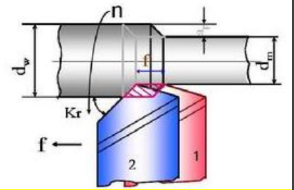

# 金属切削基础知识

## 基本定义

### 切削运动与切削用量

- 基本概念

  - 待加工表面

    即将被切去金属层的表面

  - 过渡表面

    切削刃正在切削着的表面

  - 已加工表面

    已经切去一部分金属形成的新表面

- 应用基本概念

  

- 切削运动

  为实现加工，工件与刀具之间要有相对运动，即切削运动

  基本运动: 直线运动和回转运动

  - 主运动

    $v_c$方向

  - 进给运动

    $v_f$方向

  - 合成运动和合成切削运动

    $v_e$方向

  

- 切削用量

  - 切削速度$v_c$(主运动)

    $$v _ { c } = \frac { \pi d n } { 1000 }$$

  - 进给量(单位:mm/r)

    工件或刀具每回转一周时两者沿进给运动方向的相对位移

  - 进给速度

    $$v _ { f } = f \cdot n = f _ { z } \cdot Z \cdot n$$

  - 每齿进给量$f_z$(单位:mm/z)

    后一个刀齿相对于前一个刀齿的进给量

  - 被吃刀量$a_p$(单位:mm)

    

    $$a _ { p } = \frac { d _ { w } - d _ { m } } { 2 }$$

    对于钻削:

    $$a _ { p } = \frac { d _ { m } } { 2 }$$

### 刀具切削部分的基本定义

- 刀具基本认识

  

#### 刀具切削部分的构造要素

- 前面$A_r$

  切屑流过的表面

- 后面$A_\alpha$

  - 主后面$A_\alpha$

    与工件过渡表面相面对的刀具表面

  - 副后面$A_\alpha'$

    与工件已加工表面相面对的刀具表面

- 切削刃

  前面上直接进行切削的边锋

  - 主切削刃

    前面和主后面的交线

    > 作用于待加工表面

  - 副切削刃

    前面和副后面的交线

    > 作用于已加工表面

- 刀尖

  主-副切削刃的实际交点

  可以是圆弧,也可以是直线

#### 刀具标注角度参考系

- 假设

  - 运动条件

    假定进给速度值很小, 用主运动向量$v_c$近似代替合成速度向量$v_e$

  - 安装条件

    - [ ] 略

- 基面$P_r$

  通过切削刃选定点

  垂直于假定主运动方向的平面

- 切削平面$P_s$

  通过切削刃选定点

  与主切削刃相切

  垂直于基面$P_r$的平面

  => 主切削刃与切削速度方向构成的平面

- 主剖面$P_o$

  通过切削刃选定点

  同时垂直于$P_r$和切削平面$P_s$的平面

=> 主剖面参考系: $P_r-P_s-P_o$

- 法剖面$P_n$

  通过切削刃选定点

  垂直于切削刃的平面

=> 法剖面参考系: $P_r-P_s-P_n$

- `NOTE`:

  $P_o$不一定垂直于主切削刃

  $P_n$不一定垂直于基面$P_r$

  

- 进给平面$P_f$

  通过切削刃选定点

  平行于进给运动方向并垂直于基面$P_r$的平面

- 背平面$P_p$

  通过切削刃选定点

  同时垂直于$P_r$和$P_f$的平面

=> 进给平面或背平面参考系: $P_r-P_f-P_p$

#### 刀具工作角度参考系

- 标注角度参考系

  假定运动条件下

  只考虑主运动，不考虑进给运动

- 工作角度参考系

  用$v_e$取代$v_c$

#### 刀具的标注角度

- 前角$\gamma_o$

  前面与基面间的夹角

  在主剖面$P_o$中测量

- 后角$\alpha_o$

  主后面与切削平面间的夹角

  在主剖面$P_o$中测量

- 主偏角$\kappa_r$

  主切削刃与进给运动方向的夹角

  在基面 $P_r$ 中测量

- 刃倾角$\lambda_s$

  主切削刃与基面间的夹角

  在切削平面$P_s$中测量

- 正负

  

$\gamma_o$ 和 $\lambda_s$ 决定前刀面的方位

$\alpha_o$ 和 $\kappa_r$ 决定后刀面的方位

$\kappa_r$ 和 $\lambda_s$ 决定主切削刃的方位

- 与副切削刃有关的

  看图, 类比

  

  - 副前角$\gamma_o'$
  - 副后角$\alpha_o'$
  - 副偏角$\kappa_r'$
  - 副刃倾角$\lambda_s'$

  当 $\gamma_o$ 和 $\lambda_s$ 确定后, 前刀面的方位已经确定, 可以计算 $\alpha_o'$ 和 $\kappa_r'$

  称为派生角度

- 楔角$\beta_o$

  主剖面中测量的前、后刀面间夹角

  $$\beta _ { 0 } = 90 ^ { \circ } - ( \alpha _ { 0 } + \gamma _ { 0 } )$$

- 刀尖角$\varepsilon_r$

  基面中测量的主、副切削刃间夹角

  $$\varepsilon_r = 180 ^ { \circ } - ( \kappa _ { r } + \kappa _ { r } ^ { \prime } )$$

- 参考

  - [车刀角度图文详解，说得太直观了！](https://zhuanlan.zhihu.com/p/349869738)

### 刀具的工作角度

- 进给运动对工作角度的影响

  - 横车:车断刀

    

    横向进给运动

  - 纵车:外圆车刀

    

    纵向进给运动

  $$
  \begin{aligned}
  \gamma _ { f e } &= \gamma _ { f } + \eta  \\
  \alpha _ { f e } &= \alpha _ { f } - \eta \\
  \mathrm{tan} \eta &= \frac { v_f } { v_c } = \frac { f } { \pi d_w }
  \end{aligned}
  $$

- 刀尖安装对工作角度的影响

  当刀尖安装得高于工件中心线时, 工作切削平面将变为$P_{se}$, 工作基面变为$P_{re}$

  

  根据左视图:

  $$\tan \theta _ { p } = \frac { h } { \sqrt { ( \frac { d _ { w } } { 2 } ) ^ { 2 } - h ^ { 2 } } }$$

  得到左视图角度变化(不是真正的前角和后角)

  $$
  \begin{aligned}
  \gamma _ { p e } &= \gamma _ { p } + \theta _ { p } \\
  \alpha _ { p e } &= \alpha _ { p } - \theta _ { p }
  \end{aligned}
  $$

- 刀杆安装倾斜对工作角度影响

  

  $$k _ { 0 e } = k _ { r } \pm G \quad k _ { r e } ^ { \prime } = k _ { r } ^ { \prime } \mp G$$

### 切削层参数与切削形式

- 切削层

  

  - 切削厚度$h_D$

    垂直于加工表面来度量的切削层尺寸(cutting surface, 看样子似乎是待加工表面)

    外圆纵车($\lambda_s$=0)时:

    $$h_D = f \sin \kappa_r$$

  - 切削宽度$b_D$

    沿加工表面度量的切削层尺寸

    $$b_D = a _ { p } / \sin \kappa_r$$

    

  - 切削面积$A_D$

    切削层在基面$P_r$的面积

    对于车削:

    $$A _ { D } = h _ { D } b _ { D } = f a _ { p }$$

  - 名义切削面积

    实际切削面积等于名义切削面积减去残留面积

    残留面积是指刀具副偏角$\kappa_r' \neq 0$时，刀具经过切削后，残留在已加工表面上的不平部分($\Delta ABE$)的剖面面积

    

- 切削形式

  - 正切削

    切削刃垂直于合成切削方向称为正切削或直角切削

  - 斜切削

    如果切削刃不垂直于切削方向则称为斜切削或斜角切削

  - 自由切削

    只有直线形主切削刃参加切削工作，而副切削刃不参加切削工作

  - 非自由切削

    曲线主切削刃或主、副切削刃都参加切削者

## 刀具材料

### 刀具材料应具备的性能

- 高的硬度和耐磨性
- 足够的强度和韧性
- 高的耐热性
- 良好的工艺性
- 良好的经济性

### 常用的刀具材料

材料以`高速钢`和`硬质合金`居多

- [ ] 之后补充

#### 高速钢

- 元素

  加入较多的钨、钼、铬、钒等合金元素的高合金工具钢

- 性能

  有较高的热稳定性，较高的强度、韧性、硬度和耐磨性

- 应用

  形状复杂的工具，如钻头、成形刀具、拉刀、齿轮刀具

### 硬质合金

### 其它刀具材料
