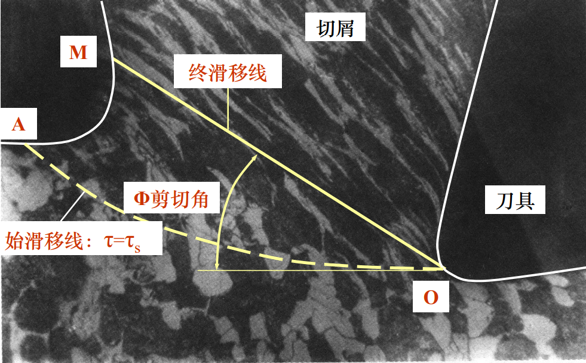
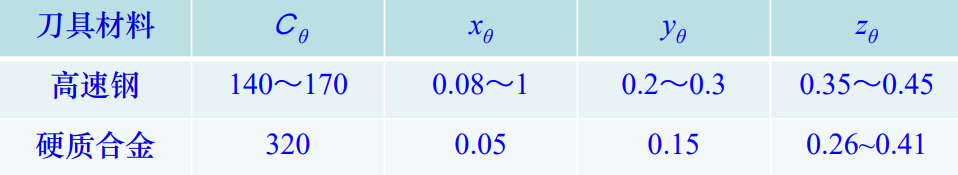

# 金属切削过程的基本规律及其应用

- 四个基本规律

- 生产中应用的几个方面

切削变形、切削力、切削热与切削温度、刀具磨损与耐用度变化等一系列现象

- 原因、影响和规律

## 金属切削过程的基本规律

### 切削变形

- 类比挤压变形和切削变形

  

- 变形区

  

  - 第 Ⅰ 变形区

    近切削刃处切削层内产生的塑性变形区

  - 第 Ⅱ 变形区

    与前刀面接触的切屑层内产生的变形区

  - 第 Ⅲ 变形区

    近切削刃处已加工表层内产生的变形区

  

#### 切屑的形成及变形特点

- 形成

  

  切削层$\overline{mn}$移至剪切面 AB，产生滑移后成为切屑的$m'n'$

- 剪切角$\Phi$

  剪切面 AB 与切削速度$v_c$之间的夹角

- 作用角$\omega$

  作用力$F_r$与切削速度$v_c$之间的夹角

- 变形区的变化

  - 第 Ⅰ 变形区

    形成切屑的变形区

    特点是切削层产生剪切滑移变形

  - 第 Ⅱ 变形区

    金属的挤压摩擦变形

    切屑沿前刀面移动时需要克服受前刀面挤压而产生的摩擦，从而进一步发生变形

    与前刀面摩擦的切屑底面一薄层金属发生晶粒纤维化。离前刀面距离越远，纤维化程度越弱

  - 第 Ⅲ 变形区

    已加工表面受到切削刃钝圆部分和后刀面的挤压摩擦，造成纤维化与加工硬化

  

  > 通过观察微观组织, 符合三个变形区的描述

#### 变形程度的度量方法

- 相对滑移$\varepsilon$

  

  $$\varepsilon = \frac { \Delta s } { \Delta y } = \frac { \overline {E ^ { \prime } C} + \overline{C B ^ { \prime \prime }} } { \Delta y } = \cot \varphi + \tan ( \varphi - \gamma _ { 0 } )$$

  > 切屑的边与前面的边平行

- 变形系数$\Lambda h$

  

  

  $$
  \begin{aligned}
  \Lambda _ { h } = \frac { l _ { c } } { l _ { c h } } &= \frac { h _ { c h } } { h _ { D } } > 1 \\
  &= \frac { \overline {A B} \cos ( \varphi - \gamma _ { 0 } ) } { \overline {A B} \sin \varphi } = \cot \varphi \cos \gamma _ { 0 } + \sin \gamma _ { 0 }
  \end{aligned}
  $$

  > 四点共圆得到角度相等

  $l_c$: 切削层长度

  $h_D$: 切削层厚度

  $l_{ch}$: 切屑长度

  $h_{ch}$: 切屑厚度

  

  剪切角 $\varphi$ 变化对切屑收缩的影响，$\varphi$ 增大剪切面 AB 减短，切屑厚度 $h_D$ 减小，故且 $\Lambda_h$ 变小

  $$\varphi \uparrow \rightarrow h _ { c h } \downarrow \rightarrow \Lambda _ { h } \downarrow = \frac { h _ { ch } } { h_D }$$

  如果增大前角$\gamma_o$和剪切角$\varphi$，使$\varepsilon$, $\Lambda_h$减小，则切削变形减小

  > $\varphi$ 与 $\gamma_o$有关系

#### 前刀面的挤压摩擦与积屑瘤

- 作用力分析

  

  $\beta$: 摩擦角

  $F_z$ 与 $F_r'$ 的夹角=$F_r$水平线的夹角 = $\beta - \gamma_o$

  $$
  \begin{aligned}
  F _ { s } &= F _ { r } ^ { \prime } \cos [ \varphi + ( \beta - \gamma _ { 0 } ) ] \\
  &= F _ { r } ^ { \prime } \cos ( \beta - \gamma _ { 0 } ) \cos \varphi - F _ { r } ^ { \prime } \sin ( \beta - \gamma _ { 0 } ) \sin \varphi \\
  &= F _ { c } \cos \varphi - F _ { p } \sin \varphi
  \end{aligned}
  $$

  $F_c$ 与 $v_c$ 方向相同

  剪应力$\tau$

  $$\tau = \frac { F _ { s } } { \frac {A _ { D }} {\sin \varphi} } = \frac { F _ { s } } { A _ { D } } \sin \varphi = \frac { F _ { c } \cos \varphi - F _ { p } \sin \varphi  } { h _ { D } \cdot b _ { D } } \sin \varphi$$

- 测量

  - $\beta$角度的测定

    $$\mu = \tan \beta = \frac {F_f} { F_n }$$

  - $\gamma_o$角度的测定

    $$\mu = \tan \beta - \gamma_o = \frac {F_p} { F_c }$$

  - 剪切角$\varphi$的确定

    M.E.Merchant 提出的按最少能量原则来确定剪切角$\varphi$的原理

    所需的切削力$F_c$是形成切削的最小切削力

    $$F _ { c } = F _ { r } ^ { \prime } \cos ( \beta - \gamma _ { 0 } ) = \frac { F _ { s } \cos ( \beta - \gamma _ { 0 } ) } { \cos ( \varphi + \beta - \gamma _ { 0 } ) } = \frac { \tau A _ { D } \cos ( \beta - \gamma _ { 0 } ) } { \sin \varphi \cos ( \varphi + \beta - \gamma _ { 0 } ) }$$

    令$\frac { \partial F _ { Z } } { \partial \varphi } = 0$, 得到:

    $$\varphi = 45 ^ { \circ } + \frac {\gamma_o } {2} - \frac {\beta} {2}$$

- 积屑瘤

  当以较低速度切削塑性金属时，通常会在刀具表面紧紧粘附一团金属，并且代替切削刃来切削工件。这团金属被称为积屑瘤。

  

  > 可以看出, 积屑瘤会使得前角增大

  形成积屑瘤的条件主要决定于`切削温度`

  

  > 看到和温度的变化关系

  接触面间压力、粗糙程度、粘结强度等因素也有关

#### 切屑类型

- 带状切屑(连续状切屑)
- 挤裂切屑(分段或锯齿状切屑)

  半连续的

- 单元切屑
- 崩碎切屑(不连续切屑)

切屑的类型是由材料的应力->应变特性和塑性变形程度决定

#### 切屑变形的变化规律

- 基本思路

  切屑变形的程度主要决定于剪切角$\varphi$和摩擦系数$\mu$的大小

  $$
  \begin{aligned}
  \varphi \uparrow &\rightarrow \Lambda_h \downarrow \\
  \mu \downarrow &\rightarrow \Lambda_h \downarrow
  \end{aligned}
  $$

- 前角

  增大前角 $\gamma_o$，使剪切角 $\varphi$ 增大

- 切削速度

  通过积屑瘤使剪切角$\varphi$改变和通过切削温度使摩擦系数$\mu$变化而影响切削变形的

  

  > 随着切削速度的增大,积屑瘤的厚度逐渐增加,前角也就进一步增大; 然后切削速度进一步增大, 因为温度升高,积屑瘤逐渐融化,前角逐渐减小, 融化到一定程度, 积屑瘤厚度保持稳定, 前角基本不变

  

  > 前角增大后减小,再到逐步稳定, 使得切削变形是先减小后增大, 再后来与前角无关, 而与摩擦系数有关; 由于切削速度增大, 温度升高, 摩擦系数减小, 切削变形进一步减小

- 进给量

  - [ ] 不能理解

- 工件材料

  材料的强度、硬度提高，正压力$F_n$增大，平均正应力$\sigma_{av}$，因此，摩擦系数$\mu$下降

- 规律总结

  $$
  \begin{aligned}
  &(A) : \varphi \uparrow \rightarrow h _ { c h } \downarrow \rightarrow \Lambda _ { h } \downarrow = \frac { h _ { ch } } { h_D } \\
  &(B) : \gamma_o \uparrow \rightarrow \varphi \uparrow = 45 ^ { \circ } + \frac {\gamma_o } {2} - \frac {\beta} {2} \rightarrow (A) \rightarrow \Lambda _ { h } \downarrow \\
  &(C) :
  \begin {cases}
  中低温&: v_c \uparrow \rightarrow 积屑瘤\uparrow \rightarrow \gamma_o \uparrow \rightarrow (B) \rightarrow \Lambda _ { h } \downarrow \\
  高温 &: v_c \uparrow \rightarrow 切削温度 \uparrow \rightarrow \mu \downarrow = \tg \beta \rightarrow \varphi \uparrow = 45 ^ { \circ } + \frac {\gamma_o } {2} - \frac {\beta} {2} \rightarrow (A) \rightarrow \Lambda _ { h } \downarrow
  \end{cases} \\
  &(D) : f \uparrow \rightarrow h_D \uparrow \rightarrow = f \sin \kappa_r \rightarrow F_n \uparrow \rightarrow \mu \downarrow = \tg \beta = \frac { F_f } { F_n } \rightarrow (C) \rightarrow \Lambda _ { h } \downarrow \\
  &(E) : 材料硬度 \uparrow \rightarrow F_n \uparrow \rightarrow (D) \rightarrow \Lambda _ { h } \downarrow \\
  \end{aligned}
  $$

### 切削力

#### 切削力的来源-合力及其分力

- 来源

  - 变形区内产生的弹性变形抗力和塑性变形抗力
  - 切屑、工件与刀具间的摩擦力

为了便于分析和测量, 将合力$F_r$分解为三个分力 => 轴向力 $F_f$, 径向力$F_p$, 主切削力$F_c$(圆周力)

#### 切削力测定和切削力实验公式

- 测量 => 电桥

- 公式形式

  $$
  \begin{cases}
  F _ { p } = C _ { F_p } a _ { p } ^ { x_{ F_p } } f ^ { y_{F_p} } K _ { F _ { p } } \\
  F _ { f } = C _ { F _ { f } } a _ { p } ^ { x _ { F_f } } f ^ { y _ { F_f } } K _ { F _ { f } } \\
  F _ { c } = C_{F_c} a_{p} ^ { x_{F_c} } f ^ { y_{F_c} } K_{F_c}
  \end{cases}
  $$

  C : 影响系数 => 与实验条件有关

  x, y : 影响指数

  K : 计算条件与实验条件不同时对切削力的修正系数

- 通常

  $$F _ { c } = C _ { F _ { c } } a _ { p } ^ { x _ { F_c } } f ^ { y _ { F_c } }$$

  $x_{ F_c } = 1$

  $y_{ F_c } = 0.75 \sim 0.9$

#### 单位切削力、切削功率和单位切削功率

- 单位切削力$p$

  切除单位切削层面积所产生的主切削力

  $$p = \frac { F _ { c } } { A _ { D } } = \frac { C _ { F c } a _ { p } ^ { x _ { F_c } } f^{y_{F_c}} } { a _ { p } f } = \frac { C _ { F_c } } { f ^ { 1 - y _ { F_c } } } N / m m ^ { 2 }$$

  随着进给量 $f$ 增加而减小

  不受背吃刀量 $a_p$ 的影响 => 影响系数$x_{F_c}$为 1

- 切削功率$P_m$

  车削时在切削区域内消耗的功率，通常计算的是主运动所消耗的功率

  $$P _ { m } = \frac { F _ { c } v _ { c } \times 10 ^ { - 3 } } { 60 } k W$$

- 单位切削功率$P_s$

  单位时间内切除单位体积金属$Z_w$所消耗的功率

  $$P _ { s } = \frac { P _ { m } } { Z _ { w } } = \frac { p a _ { p } f v_ { c } } { 1000 a _ { p } f v _ { c } } \times 10 ^ { - 3 } = p \times 10 ^ { - 6 } k W / ( m m ^ { 3 } \cdot s ^ { - 1 } )$$

#### 切削力的变化规律

- 工件材料
- 切削用量

  - 背吃刀量和进给量
  - 切削速度

    积屑瘤与摩擦 => 如同对切削变形影响一样

    $$\Lambda_h \downarrow \rightarrow F_c \downarrow$$

- 刀具几何参数

  - 前角

    通过切削变形

  - 主偏角

    改变使切削面的形状和切削分力$F_f$的作用方向改变

    主偏角 $\kappa_r$ 在$30^\circ\sim60^\circ$ 范围内增大，由切削厚度 hD 的影响起主要作用，促使主切削 $F_c$ 减小

    主偏角约在$30^\circ\sim60^\circ$范围内增大，刀尖处圆弧和副前角的影响更为突出，故主切削力 $F_c$ 增大

  - 刃倾角

    对主切削力$F_c$影响很小，但对切深抗力$F_p$、进给抗力$F_f$影响较显著

    切削时不宜选用过大的负刃倾角

- 其它方面

  刀具的棱面,刀尖圆弧半径,刀具磨损的影响

- 总结

  - [ ] 转化为 latex

  

### 切削热与切削温度

#### 切削热的来源与传导

- 来源 => 由切削功转变而来的

#### 切削温度

单位时间内产生的热 $q$ 等于消耗的切削功率 $P_m$

$$q = \frac {F _ { c } v _ { c }} {60} \quad W$$

根据$q= c m \Delta T$的公式, 得温度升高量$\Delta \theta$:

$$\Delta \theta = \frac { F _ { c } v _ { c } } { c \cdot \rho \cdot v _ { c } \cdot h _ { D } \cdot b _ { D } } = \frac { p } { c \cdot \rho } \ ^\circ C$$

#### 影响切削温度的因素

切削温度与变形功、摩擦功和热传导有关

- 切削用量

  $$\theta = C _ { \theta } v _ { c } ^ { z _ { \theta } } f ^ { y _ { \theta }  } a_p ^ { x_\theta }$$

  

- 刀具几何参数

  - 前角

    前角增大, 切削变形和摩擦减少

    但是, 继续增大至 15° 左右, 由于楔角减少使刀具散热变差，切削温度略上升

  - 主偏角

    主偏角减少，切削宽度$b_D$增大，切削厚度$h_D$减少 => 切削变形和摩擦增大,切削温度升高

    但是, 当切削宽度 bD 增大后, 散热条件改善。散热起主要作用，故随着主偏角减少，切削温度下降

    - [ ] 理解起来很怪异

- 工件材料
- 切削液

- 总结

  

  

  

### 刀具磨损与刀具耐用度

#### 刀具磨损形式

- 正常磨损

  符合要求的情况下，刀具在切削过程中逐渐的磨损

  - 后刀面磨损
  - 前刀面磨损
  - 前后刀面同时磨损

- 非正常磨损

  突然或过早产生损坏

  

#### 磨损过程和磨钝标准

- 刀具磨损标准

  太钝而不能再工作时的极限所引起的磨损

  通常是通过观察来判断的

  在后刀面测得的 $V_B$ 值作为刀具磨损的标准

- 高速钢和硬质合金刀具磨钝标准:

  - 在后刀面 B 区内均匀磨损

    $$V_B = 0.3mm$$

  - 在后刀面 B 区内非均匀磨损

    $$V_{B \max} = 0.6mm$$

  - 月牙洼深度标准

    $$K_T = 0.06 + 0.3f$$

#### 刀具磨损原因

- 磨粒磨损

  “磨粒”硬质点的来源 => 切屑底层和切削表面材料的硬颗粒

  粘附着积屑瘤的碎片、锻造表皮和铸件上残留的夹砂

- 粘结磨损

  接触面吸附膜被挤破，形成了新鲜表面接触, 当接触面间达到原子间距离时就产生粘结

  由于接触面滑动在粘结处产生剪切破坏造成的

  通常剪切破坏在较软金属一方, 刀面也会强度降低，会破坏

  前刀面上粘结的积屑瘤脱落时，带走了刀具材料，也形成粘结磨损

- 扩散磨损

  高温作用, 合金元素相互扩散置换，使刀具材料机械性能降低, 刀具容易被磨损

- 相变磨损

  刀具上最高温度超过材料相变温度

  如马氏体组织转变为奥氏体，使硬度下降，磨损加剧

- 氧化磨损

  在主、副切削刃与切削层金属表面接触处，硬质合金中 WC、 Co 氧化成脆性、低强度的氧化膜 $WO_2$

  摩擦和冲击作用，形成了边界磨损

#### 刀具寿命

- 概念

  刃磨后的刀具从开始切削到磨损量达到磨钝标准为止所用的切削时间，用 T 分钟表示

#### 影响刀具寿命的因素

- 切削速度

  $$v _ { c } = \frac { A } { T ^ { m } }$$

  A: 系数

- 进给和背吃刀量

  $$f = \frac { B } { T ^ { n } } , a_p = \frac { c } { T ^ { \rho } }$$

- 刀具寿命合理数值的确定

  - 最高生产率耐用度$T_p$

    $$t _ { p r } = t _ { m } + t _ { 1 } + t _ { c } \frac {t _ { m }}  {T}$$

    $t_{pr}$ : 加工一个零件的生产时间

    $t_{m}$ : 切削时间

    $t_{1}$ : 辅助时间(非切削时间)

    $t_{c}$ : 一次换刀所需时间(min/次)

    $T$ : 换刀次数

    求导得到:

    $$T _ { P } = ( \frac { 1 - m } { m } ) t _ { c }$$

    > 单个零件的计算

  - 最低生产成本耐用度$T_c$

    $$C _ { p r } = M t _ { m } + M t _ { l } + M t _ { c } \frac { t _ { m } } { T } + C _ { t } \frac { t _ { m } } { T }$$

    $C_{pr}$ : 每个零件平均加工成本

    $M$ : 每分钟开支分摊到本零件的加工费用

    $C_{t}$ : 换刀一次所需费用

    求导得到:

    $$T _ { c } = \frac { 1 - m } { m } ( t _ { c } + \frac { C _ { t } } { M } )$$

  可以发现:$T_c > T_p$

  > $T_p$单纯考虑的是效率, 刀损害了无所谓, $T_c$考虑成本, 需要注意刀的磨损成本

- 影响因素

  - 切削用量的影响

    $$T ^ { m } = \frac { C _ { v } } { v _ { c } a _ { p } ^ { x _ { v } } \cdot f ^ { y _ { v } } }$$

    - 许可切削速度

      $$v _ { T } = \frac { C _ { v } } { T ^ { m } a_p ^ {x _ { v } } f^{ y_v } } \cdot k _ { v }$$

  - 刀具几何参数的影响

    前角

    主切削刃角度

  - 加工材料的影响

    强度、硬度、延伸率、导热系数

  - 刀具材料的影响

    热硬度、冲击韧性

## 金属切削过程基本规律的应用

### 工件材料的切削加工性

- 刀具寿命指标

  在切削普通金属材料时，用刀具寿命达到 60min 时允许的切削速度$v_{60}$的高低来评定材料的加工性。难加工材料用$v_{20}$来评定

  越高，切削加工性越好

  - 相对加工性

    $$K_v = \frac { v _ { 60 } } { v _ { 060 } }$$

    $v_{060}$: 45 号钢为基准

- 加工表面粗糙度指标

  粗糙度值低，加工性好；反之，加工性差

- 改善材料切削加工性的措施

  - 调整化学成分
  - 材料加工前进行合适的热处理
  - 选择加工性好的材料状态
  - 其它

### 切削液

主要用来减少切削过程中的摩擦和降低切削温度

对提高刀具寿命和加工表面质量、加工精度起重要的作用

- 作用

  - 冷却作用
  - 润滑作用——边界润滑原理
  - 洗涤与防锈作用

- 常用

  - 水溶液 => 冷却作用
  - 切削油 => 润滑作用
  - 乳化液

    浓度低的乳化液含水比例多 => 冷却作用, 适用于粗加工和磨削

    浓度高的乳化液 => 润滑作用, 适用于精加工

  - 极压切削油和极压乳化液

    在切削油或乳化液中加入极压添加剂

    在高温条件下提高冷却和润滑作用

### 刀具几何参数的合理选择

- 前角-前刀面的功用和选择

  

  

  - 选择原则

    在刀具强度许可条件下，尽量选用大的前角

    对于成形刀具来说(车刀、铣刀和齿轮刀等)，减小前角；可减少刀具截形误差，提高零件的加工精度

    

- 后角和后刀面的功用和选择

  

- 主偏角-副偏角的功用与选择

  影响切削层的形状

  - 主偏角

    影响断屑和排屑的方向

    刚性不足的情况下，为减小切削力，选取较大的主偏角

    加工强度高、硬度高的材料时，为提高刀具寿命，选取较小主偏角

  - 副偏角

    影响加工表免粗糙度和刀具强度

    不产生摩擦和振动的条件下，应选择较小的副偏角

  

- 刃倾角功用与选择

  主要影响切屑的流向和刀具强度

  

### 切削用量的合理选择

- 生产效率

  切削用量 $a_p$、$f$ 和 $v_c$ 增大，切削时间减小

  尽量优先增大 $a_p$

- 机床功率

  当背吃刀量和切削速度增大时，均使切削功率成正比增加

  增大进给量$f$使切削力增加较少、消耗功率也较少 =>粗加工, 尽量增大进给量

- 刀具寿命

  影响依次递减:$v_c, f, a_p$

  此时增大$a_p$可以增大效率, 而又相对小地影响盗掘寿命

- 表面粗糙度

  在半精加工、精加工时确定切削用量应考虑的主要原则

  $v_c$增大, 减小粗糙度

  $a_p$影响不大

  加工表面粗糙度主要限制的是进给量 $f$ 的提高

- 综上

  - 选择一个尽量大的$ap$
  - 选择一个大的 $f$
  - 根据已确定的，并在刀具寿命和机床功率下选择一个 $v_c$

#### 切削用量选择方法

- 粗车时切削用量的选择

  - 背吃刀量

    除留给下道工序的余量外，其余的粗车余量尽可能一次切除，以使走刀次数最少

    当粗车余量$\Delta$太大或加工的工艺系统刚性较差时，则加工余量$\Delta$分两次或数次走刀后切除

    第一次: $a _ { p 1 } = ( \frac { 2 } { 3 } \sim \frac { 3 } { 4 } ) \Delta$

    第二次: $a _ { p 2 } = ( \frac { 1 } { 3 } \sim \frac { 1 } { 4 } ) \Delta$

  - 进给量

    $a_p$和$f$可以确定切削力, 合理选择

  - 切削速度

    利用刀具寿命确定

  - 校验机床功率

    $$F _ { z } \cdot v _ { c } \leq P _ { E } \cdot \eta \times 10 ^ { - 3 }$$

- 半精车-精车切削用量选择

  - 背吃刀量

    半精车的余量较，约 1$\sim$2mm 左右

    当使用硬质合金时，背吃刀量不宜过小，一般大于 0.5mm

  - 进给量

    由于$a_p$不大,故力的影响不是主要考虑

    增大进给量主要受到表面粗糙度的限制

  - 切削速度

    $a_p$和$f$都小, 功率不是主要因素

    切削速度主要受刀具寿命限制

## 目前金属切削发展的几个前沿方向
