# 零件加工工艺的基本概念与知识

- “加工”包含了机械加工手段与过程

  - 手段

    机械设备, 包含机床、夹具等辅助工具

  - 过程

    加工工艺, 包含定位基准、加工余量等

## 零件机械加工的目标与内容

### 生产过程

- 概念

  是将原材料转变为成品的一系列相互关联的劳动过程的总和

### 工艺过程

- 工艺过程

  直接改变原材料或毛坯 => 合格零件

- 装配工艺过程

  零件装配成部件或产品

- 工艺过程的组成

  一个或若干个依次排列的工艺所组成

  > 可以看见毛坯的状态不断改变, 中间状态的毛坯称为半成品

- 工序

  一个（或一组）工人，在一个固定的工作地点（一台机床或一个钳工台），对一个（或同时对几个）工件所连续完成的那部分工艺过程

  它是工艺过程的基本单元，又是生产计划和成本核算的基本单元

- 工步

  工步是工序的组成单位

  在被加工的表面、切削用量（指切削速度和进给量）、切削刀具均保持不变的情况下所完成的那部分工序，称工步

  当其中有一个因素变化时，则为另一个工步

- 复合工步

  当同时对一个零件的几个表面进行加工时

- 走刀

  被加工的某一表面，由于余量较大或其他原因，在切削用量不变的条件下，用同一把刀具对它进行多次加工，每加工一次，称一次走刀

  > 发现工步没有规定被吃刀量

- 安装

  工件在加工前，在机床或夹具中相对刀具应有一个正确的位置并给予固定，这个过程称为装夹

  一次装夹所完成的那部分加工过程称为安装

  安装是工序的一部分

  安装次数应尽量少 => 效率和加工误差

- 工位

  为减少工序中的装夹次数，常采用回转工作台或回转夹具，使工件在一次安装中，可先后在机床上占有不同的位置进行连续加工，每一个位置所完成的那部分工序，称一个工位

  多工位加工 => 效率和相互位置精度

### 生产纲领与生产类型

- 生产纲领

  企业在计划期内应当生产的产量和进度计划

  $$N = Q \cdot n ( 1 + \alpha \% ) ( 1 + \beta \% )$$

  $N$ :零件的年生产纲领（件/年）

  $Q$ :产品的年产量（台/年）

  $n$ :每台产品中该零件的数量（件/台）

  $\alpha$ :备品的百分率

  $\beta$ :废品的百分率

- 生产类型

  企业生产专业化程度的分类

  分为单件生产、成批生产和大量生产

## 工件定位原理

### 六点定位原理

- 概念

  欲使工件在空间取得唯一位置，则必须限制六个自由度

- 完全定位

  工件的六个自由度全部被夹具中的定位元件所限制，而在夹具中占有完全确定的惟一位置

- 不完全定位

  有些自由度对加工要求无影响

  不完全定位是允许的

- 欠定位

  按照加工要求应该限制的自由度没有被限制的定位

  欠定位是不允许的

- 过定位

  自由度被不同的定位元件重复限制的定位

  当过定位导致工件或定位元件变形，影响加工精度时，应该严禁采用

### 定位方式与定位元件

- 定位副

  工件上的定位基准面与相应的定位元件

- 以平面定位

  采用支承钉、支承板为固定定位元件

  还采用可调支承、自位支承和辅助支承元件

  - 支撑钉

    - 平头（A 型）

      平头型支承钉耐磨性好，常用于精基面定位

    - 球头（B 型）

      钉容易与工件的定位基面接触，位置稳定，但容易磨损

    - 网纹顶面（C 型）

      可增大与工件的摩擦力，但容易存屑，一般用于侧面定位

  - 支撑板

    - A 型

      结构简单

      埋头螺钉孔处容易积存切屑

      常用于侧面定位

    - B 型

      比较通用，常用于底面定位

    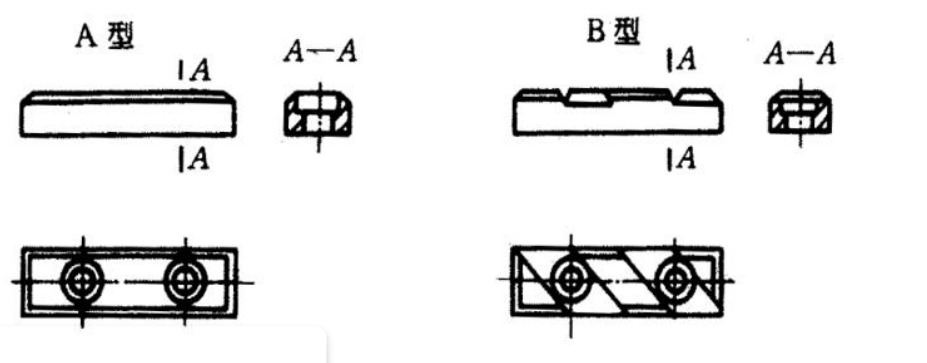

  - 可调支撑

    适用于工件定位表面不规整或加工余量不均匀时的位置调整

    也可作为组合夹具的调整元件或辅助支承以提高局部刚度

  - 自位支撑

    在定位过程中支承元件的支承点可以自动调整其位置以适应工件表面的变化

    实质只起一个支承点的作用，只限制一个自由度

  - 辅助支撑

    工件已定位后才用的支承，不作定位而只起增加工件刚度的作用

- 以圆柱孔定位

  - 心轴

  - 定位销

    为固定式和可换式

    圆柱销、削边销（菱形销）和圆锥销

    - 圆柱定位销

      长销 => $\frac {L} {d} \geq 0.8 \sim 1$

      短销 => $\frac {L} {d} \leq 0.4$

    - 削边销 => 仅可限制 1 个自由度

    - 圆锥销
      - 全圆锥销
      - 三段圆锥销

- 工件以外圆柱面定位

  - V 形块

    长 V 形块或两个短 V 形块 => $\hat y, \hat z, \vec{y}, \vec{z}$

    一个短 V 形块 => $\vec{y}, \vec{z}$

> 注意地面也是一个定位元件

### 定位符号及其标注

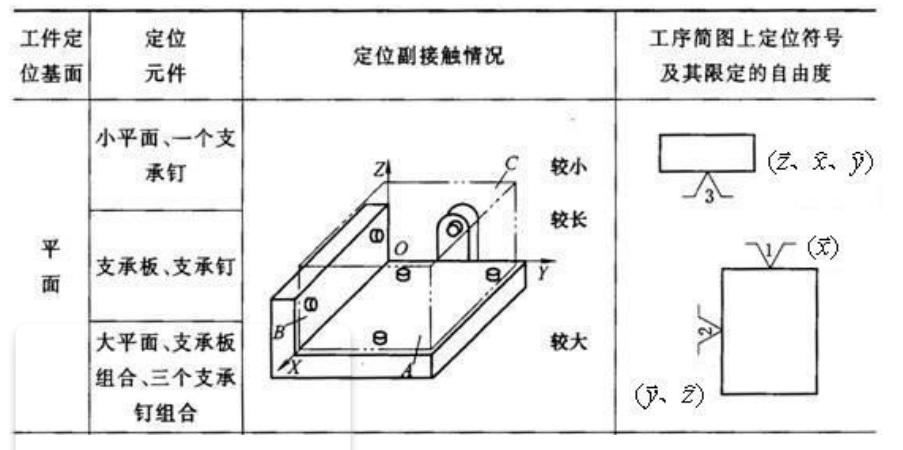

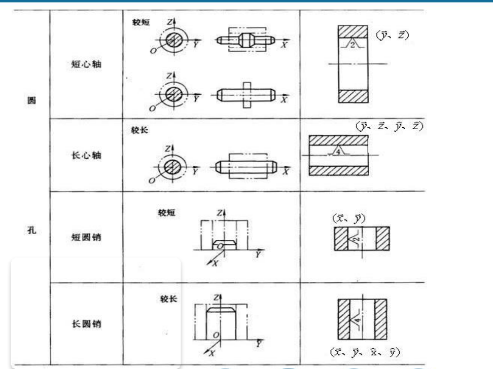

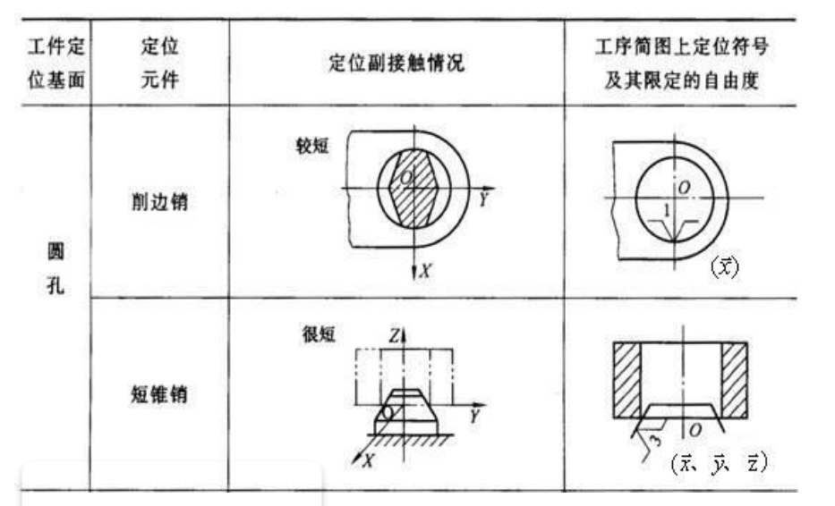

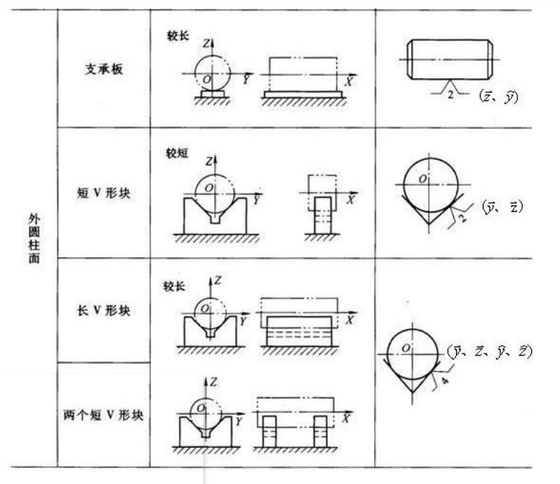

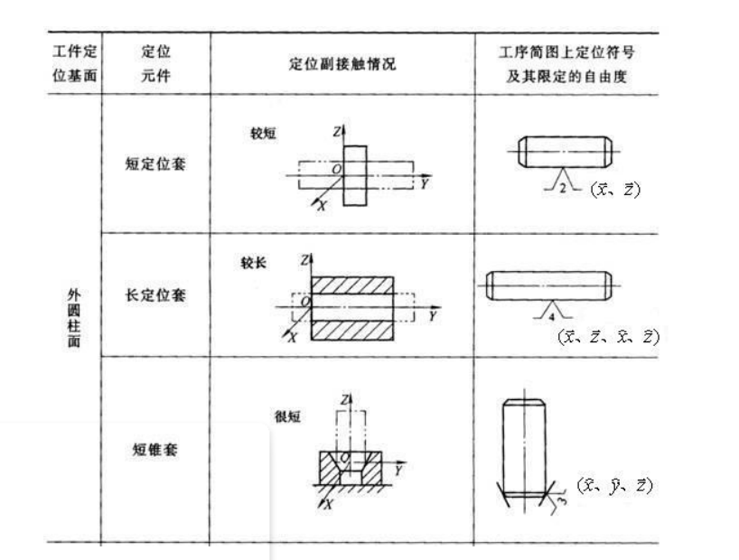

## 定位基准的选择与定位误差的计算

### 基准的分类

- 设计基准

  设计人员在零件图上标注尺寸或相互位置关系时所依据的那些点、线、面称为设计基准

- 工艺基准(制造基准)

  零件在加工或装配过程中所使用的基准，称为工艺基准

  - 工序基准

    工序图上标注

  - 定位基准

    工件在机床上加工

  - 测量基准
  - 装配基准

### 定位基准的选择

- 分类

  - 粗定位基准

    以未加工过的表面进行定位的基准称粗基准

  - 精定位基准

    以已加工过的表面进行定位的基准

  - 辅助定位基准

    便于零件的加工而设置的基准

  简称为粗基准、精基准和辅助基准

- 精基准的选择

  - 基准重合原则

    尽量选择工序基准（或设计基准）为定位基准

    减少由于定位不准确引起的加工误差

  - 基准不变原则

    尽可能使各个工序的定位基准相同

  - 互为基准，反复加工的原则

    当两个表面相互位置精度要求较高时，则两个表面互为基准反复加工

  - 自为基准的原则

    当精加工或光整加工工序要求余量小而均匀时，可选择加工表面本身为精基准

  - 应能使工件装夹稳定可靠、夹具简单

    一般常采用面积大、精度较高和粗糙度较低的表面为精基准

- 粗基准的选择

  在零件加工过程的第一道工序，定位基准必然是毛坯表面，即粗基准

  - 选择要求加工余量小而均匀的重要表面为粗基准，以保证该表面有足够而均匀的加工余量

  - 以不加工表面为粗基准

    与加工表面有相互位置精度要求的表面

  - 选择比较平整、光滑、有足够大面积的表面

  - 粗基准在一般情况下只允许在第一道工序中使用一次，尽量避免重复使用

### 定位误差及计算

- 保证加工质量

  $$\Delta _ { total } \leq \delta$$

  $\Delta$: 各种因素产生误差的总和

  $\delta$: 工件被加工尺寸的公差

  $$\Delta _ { total } = \Delta _ { 定 } + \omega$$

  $\Delta _ { 定 }$: 定位误差

  $\omega$: 其它因素所引起的误差总和, 可按加工经济精度查表确定

### 定位误差的组成

- 组成

  - 基准不重合误差

    定位基准与工序基准不一致

    工序基准相对定位基准在加工尺寸方向上的最大变动量

  - 基准位置误差

    定位基准面和定位元件本身的制造误差

    定位基准的相对位置在加工尺寸方向上的最大变动量

  $$\Delta _ { 定 } = \Delta _ { 不 } + \Delta _ { 基 }$$

### 各种定位方法的定位误差计算

- 工件以平面定位时的定位误差

  - 主要定位基准

    限制三个自由度, 主要定位作用

  - 导向定位基准

    限制两个自由度, 起次要定位作用

  - 止动定位基准

    限制一个自由度

- 工件在 V 型块上以外圆柱定位的定位误差

  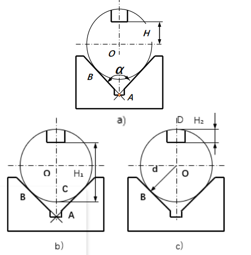

  - (a)

    由$\Delta_{不} = 0$得:

    $$\Delta _ { 定 ( H ) }  = \Delta _ { 基 ( H ) } = \partial ( \overline {OA} ) = \partial ( \frac {d} { 2 \sin ( \frac {\alpha} {2} ) }) = \frac { T_d } { 2 \sin \frac {\alpha} {2} }$$

  - (b)

    - 基准不重合误差 => 定位基准从 O 点转换到 C 点引起的误差
    - 基准位置误差 => 由于外圆尺寸变化（即基准副制造误差）带来的基准误差

    直接从定义考虑:

    $$\Delta _ { 定 ( H_1 ) }  = \partial ( \overline {CA} ) = \partial ( \overline {OA} ) - \partial R = \frac { T_d } { 2 \sin \frac {\alpha} {2} } - \frac {T_d} {2} = \frac { T _ { d } } { 2 } ( \frac { 1 } { \sin \frac {\alpha} {2} } - 1 )$$

  - (c)

    $$\Delta _ { 定 ( H_2 ) }  = \partial ( \overline {DA} ) = \frac { T _ { d } } { 2 } ( \frac { 1 } { \sin \frac {\alpha} {2} } + 1 )$$

  - 定位误差随工件误差的增大而增大
  - 定位误差随$\alpha$增大而减小, 但定位稳定性变差

    一般$\alpha = 90^{\circ}$

  - 图 b 标注好

- 工件以内孔表面定位时的定位误差

  都为中心线 => 基准重合 => $\Delta _ { 不 ( H ) } = 0$

  - 心轴铅直放置

    轴与孔的接触位置不固定

    $$\Delta _ { 定 } = \overline {OO_1} = \delta_D + \delta_d + \Delta_{min} = \Delta_{\max}$$

    $\Delta_{\max}$: 配合的最大间隙

  - 心轴水平放置

    工件始终靠往心轴一边下垂

    $$\Delta _ { 定 } = \frac {1} {2} \Delta_{\max}$$

## 工件的夹紧

#### 夹紧力的方向

1. 大型工件需要各个定位元件都有夹紧力；小型工件只需要垂直主要定位面由夹紧力。
2. 夹紧力的方向应方便装夹和有利于减小夹紧力。
3. 夹紧力的方向应使工件夹紧后的变形小。

#### 夹紧力的作用点

1. 作用点位置应保证工件的正确定位而不发生位移或偏转。
2. 作用点应在工件的刚度大处，并有足够作用点，以减小工件的变形量。
3. 作用点应尽量靠近被加工表面。

#### 夹紧力的大小

$$F_Q = K F_Q'$$

一般，粗加工时，$K_Q$ 取 2.5 ~ 3，精加工取 1.5 ~ 2。

#### 工件装夹方法

- 直接找正定位装夹：用于单件、小批生产；精度高
- 按划线找正装夹：精度低；用于单件、小批生产
- 在夹具中装夹

#### 装夹装置

- 斜楔夹紧
- screwing clamping
- centring clamping

## 零件获得加工精度的方法

### 获得尺寸精度

- 试切法
- 定尺寸刀具 => 用具有一定尺寸精度的刀具(铰刀, 扩孔钻, 钻头)
- 调整法 => 使刀具相对于机床或夹具达到一定的位置精度
- 自动控制法

### 获得形状精度

- 轨迹法

  切削运动中刀具作一定规律的轨迹运动对工件进行加工

- 相切法

  边旋转边做轨迹运动对工件进行加工

- 成形法

  刀具的切削刃与所需要形成的发生线完全吻合

  > 刀刃即形状, 然后用轨迹法切出面

- 展成法（齿轮）

  刀刃在被加工表面上的包络面形成成形表面

## 零件工艺规程制定的基本原则与步骤

### 工艺规程及应用

- 机械加工工艺过程卡片

  以工序为单位

- 机械加工工序卡片

  在工艺过程卡片的基础上, 要详细记录工序内容和加工所必须的工艺资料

### 机加工零件的结构工艺性

- 零件局部结构的工艺性

  - 刀具进刀与退刀的方便性

    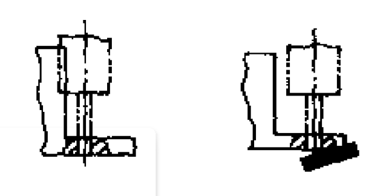

  - 确定刀具能否正常工作

    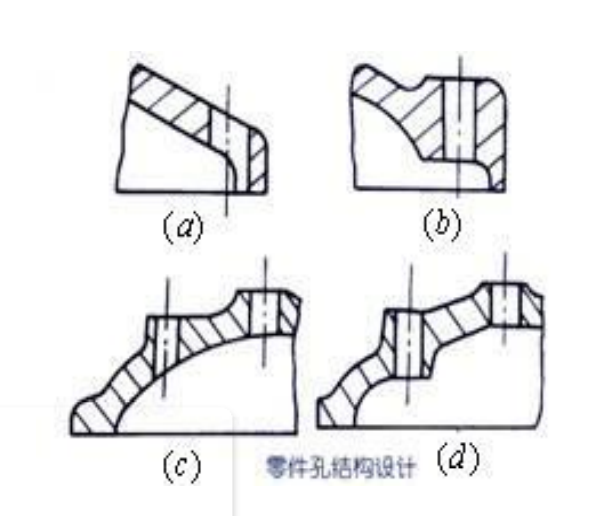

  - 考虑机加工效率

    同一轴的键槽在同一水平线上

  - 避免深孔加工
  - 使用外连接代替内连接
  - 考虑零件的刚度

- 零件整体结构的工艺性
  - 尽可能选用标准件和通用件
  - 在符合耐用性的条件下，尽可能选用经济性较好的精度和表面粗糙度
  - 选用具有良好加工性能的材料
  - 装夹和定位的参考基准
  - 节省材料和减轻重量

### 加工阶段的划分

- 粗加工阶段

  尽量将零件各个被加工表面的大部分余量从毛坯上切除

- 精加工阶段

  保证各主要表面达到较高的精度和较低的粗糙度值

- 划分粗、精加工阶段的原因

  - 粗加工阶段，由于切除大量的多余金属，可以及早发现毛坯的缺陷
  - 粗加工阶段容易引起工件的变形，通过逐步减少加工余量和切削用量的办法可消除上述变形
  - 划分加工阶段可以合理使用机床
  - 插入必要的热处理工序

### 工序的划分

- 原则

  - 工序集中

    —将若干个工步集中在一个工序内完成

  - 工序分散

    最大限度的分散是在一个工序内只包括一个简单的工步

    工艺装备结构简单, 专用性强

  > 真类似写代码, 函数和类的划分

### 工序的安排

#### 加工顺序的确定

- 先粗后精
- 先基准面后其它面
- 先主要表面，后次要表面
  1.  次要表面常从加工方便和经济角度安排
  2.  次要表面往往与主要表面有位置精度要求，可以主要表面为基准加工
- 先平面，后孔加工
  1.  以面作定位加工孔，可以使定位准确、稳定。
  2.  在毛坯面上钻孔或镗孔容易使钻头引偏或打刀。

#### 热处理安排

1. 退火和正火可改善加工性能，在加工前进行。
2. 大而复杂的零件常在粗加工后人工时效以减少内应力引起的变形。
3. 调质改善材料的力学性能，一般在粗加工后进行。
4. 淬火或渗碳可提高硬度和耐磨性。淬火在磨削前进行，渗碳淬火在半精加工前。
5. 表面处理提高零件的耐磨性、耐蚀性，使表面美观，在最后进行。

#### 检验工序的安排

## 加工余量-工艺尺寸链-经济加工精度

### 加工余量的概念

为保证零件图上某平面的精度和表面粗糙度，需要从其毛坯表面上切取全部多余的金属层，这一金属层的总厚度称为该表面的**加工总余量**。

每一工序所切除的金属层厚度称为**工序余量**。

- 关系

  $$Z _ { 总 } = Z _ { 1 } + Z _ { 2 } + . . . Z _ { i } + . . . + Z _ { n }$$

  n 为加工该表面的工序（或工步）数目

### 影响加工余量的因素

- 上工序表面质量 Ra、Ta 的影响
- 上工序尺寸公差($\delta_a$)的影响
- 上工序各表面相互位置空间偏差($\rho_a$)的影响
- 本工序加工时装夹误差($\Delta \varepsilon_b$)的影响

### 确定加工余量的方法

- 计算法（最合理，但需要可靠实验数据且费时，适用于大量生产）
- 查表法（最广泛）
- 经验法（余量偏大）

### 工艺尺寸链

- 尺寸链概念

  - 封闭环 => 中间接得到的
  - 组成环 => 除封闭环之外的
  - 增环 => 使得封闭换增大的组成环
  - 减环 => 使得封闭换减小的组成环

- 尺寸链的分类

  - 按尺寸链的应用范围分
    - 工艺尺寸链
    - 装配尺寸链
  - 按尺寸链中各组成环所在的空间位置分
    - 线性尺寸链
    - 平面尺寸链
  - 按尺寸链各环的几何特征分
    - 长度尺寸链
    - 角度尺寸链
  - 按尺寸链之间相互联系的形态分

    - 独立尺寸链
    - 并联尺寸链

      两个或两个以上的尺寸链，通过公共环将它们联系起来组成并联形式的尺寸链

- 尺寸链计算的基本公式

#### 解决反计算问题

- 等公差原则
- 等精度原则
- 利用协调环分配

### 经济加工精度

某种加工方法的**经济精度**是指在**正常工作条件**下所能达到的加工精度。

## 观念

- 基准先行

- 粗精加工分开

- 阶段化

### 六点定位原理

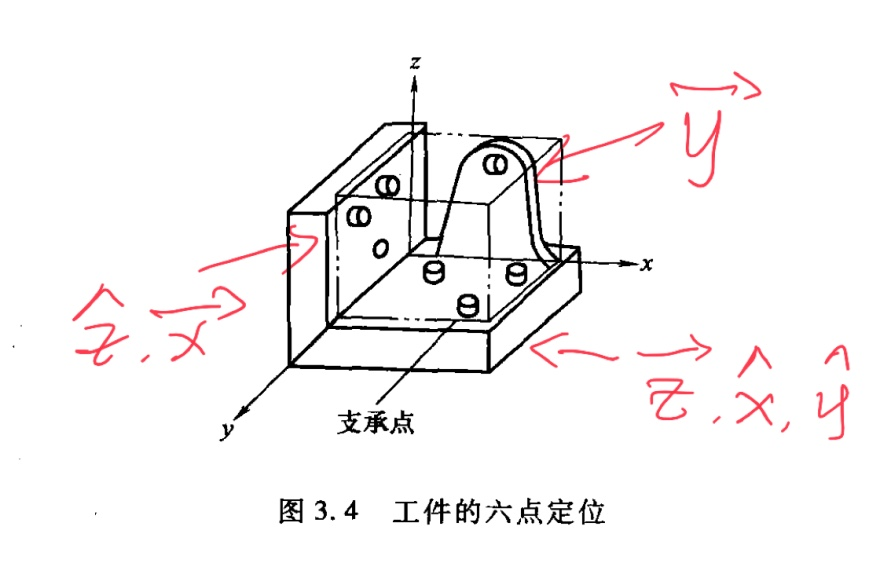

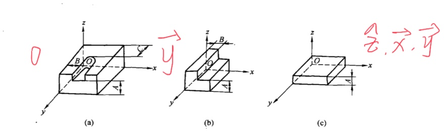

- 一批工件在夹具中占有正确的加工位置
- 夹具装夹在机床上的准确位置
- 刀具相对夹具的准确位置

> 涉及三层关系,即零件相对于夹具、夹具相对于机床、零件相对于机床。工件的最终精度是由零件相对于机床获得的。
