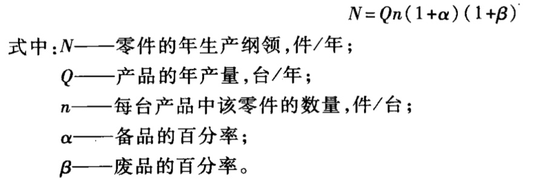
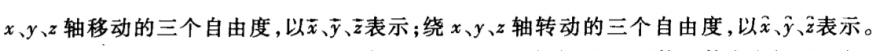

# 零件加工工艺的基本概念与知识

基准先行

粗精加工分开

阶段化

## 零件机械加工的目标与内容

## 机械加工工艺基本概念

### 生产过程

### 工艺过程

### 生产纲领与生产类型

- 生产纲领

生产纲领是指企业在计划期内应当生产的产量和进度计划

- 生产类型

生产类型是指企业生产专业化程度的分类。

生产类型分为单件生产、成批生产和大量生产三种

## 工件定位原理

- 一批工件在夹具中占有正确的加工位置
- 夹具装夹在机床上的准确位置
- 刀具相对夹具的准确位置

> 涉及三层关系,即零件相对于夹具、夹具相对于机床、零件相对于机床。工件的最终精度是由零件相对于机床获得的。

### 六点定位原理

若使物体在某方向有确定的位置，就必须限制在该方向的自由度，所以要使工件在空间处于相对固定不变的位置，就必须对六个自由度加以限制。

- 限制的方法

> 用相当于六个支承点的定位元件与工件的定位基准面接触

> 不一定要限定六个自由度

> 注意地面也是一个定位元件

- 长 V - 4
- 短 V - 2
- 长心轴 - 4
- 短心轴 - 2

基准

误差:两类 △
△ 不

### 定位方式与定位元件

#### 平面定位

- 支承钉
  - 平头型
  - 球头型
  - 网纹顶面型
- 支撑板
- 可调支承
- 自位支承
- 辅助支承：增加刚度

#### 圆柱孔定位

- 心轴
- 定位销

##### 定位销

按装配形式分：
- 固定式
- 可换式

按结构分：
- 圆柱销
  - 长销：$L/d \ge 0.8 \sim 1$
  - 短销：$L/d \le 0.4$
  - 削边销
- 圆锥销
  - 全圆锥销
  - 三段圆锥销

### 定位误差

定位误差是指由于工件定位造成的加工面相对工序基准的位置误差。

定位误差就是工序基准在加工尺寸方向上的最大变动量。

#### 组成

- 基准不重合误差
- 基准位置误差

#### 定位误差的计算

##### 内孔与定位心轴

心轴竖直放置时

$$\Delta_定 = \delta_D + \delta_d + \Delta_{min} = \Delta_{max}$$

心轴水平放置时

$$\Delta_定 = \frac{1}{2} (\delta_D + \delta_d + \Delta_{min}) = \frac{1}{2} \Delta_{max}$$

### 夹紧

#### 夹紧力的方向

1. 大型工件需要各个定位元件都有夹紧力；小型工件只需要垂直主要定位面由夹紧力。
2. 夹紧力的方向应方便装夹和有利于减小夹紧力。
3. 夹紧力的方向应使工件夹紧后的变形小。

#### 夹紧力的作用点

1. 作用点位置应保证工件的正确定位而不发生位移或偏转。
2. 作用点应在工件的刚度大处，并有足够作用点，以减小工件的变形量。
3. 作用点应尽量靠近被加工表面。

#### 夹紧力的大小

$$F_Q = K F_Q'$$

一般，粗加工时，$K_Q$ 取 2.5 ~ 3，精加工取 1.5 ~ 2。

#### 工件装夹方法

- 直接找正定位装夹：用于单件、小批生产；精度高
- 按划线找正装夹：精度低；用于单件、小批生产
- 在夹具中装夹

#### 装夹装置

- 斜楔夹紧
- screwing clamping
- centring clamping

### 获得加工精度的方法

#### 获得尺寸精度

- 试切法
- 定尺寸刀具
- 调整法
- 自动控制法

#### 获得形状精度

- 轨迹法
- 成形法
- 相切法
- 展成法（齿轮）

### 工艺规程

- 机械加工工艺过程卡片
- 机械加工工序卡片

### 工序安排

#### 加工顺序

- 先粗后精
- 先基准面后其它面
- 先主要表面，后次要表面
	1. 次要表面常从加工方便和经济角度安排
	2. 次要表面往往与主要表面有位置精度要求，可以主要表面为基准加工
- 先平面，后孔加工
	1. 以面作定位加工孔，可以使定位准确、稳定。
	2. 在毛坯面上钻孔或镗孔容易使钻头引偏或打刀。

#### 热处理安排

1. 退火和正火可改善加工性能，在加工前进行。
2. 大而复杂的零件常在粗加工后人工时效以减少内应力引起的变形。
3. 调质改善材料的力学性能，一般在粗加工后进行。
4. 淬火或渗碳可提高硬度和耐磨性。淬火在磨削前进行，渗碳淬火在半精加工前。
5. 表面处理提高零件的耐磨性、耐蚀性，使表面美观，在最后进行。

## 加工余量、工艺尺寸链、经济加工精度

### 加工余量的概念

为保证零件图上某平面的精度和表面粗糙度，需要从其毛坯表面上切取全部多余的金属层，这一金属层的总厚度称为该表面的**加工总余量**。

每一工序所切除的金属层厚度称为**工序余量**。

### 影响加工余量的因素

- 上工序表面质量 Ra、Ta 的影响
- 上工序尺寸公差($\delta_a$)的影响
- 上工序各表面相互位置空间偏差($\rho_a$)的影响
- 本工序加工时装夹误差($\Delta \varepsilon_b$)的影响

### 确定加工余量的方法

- 计算法（最合理，但需要可靠实验数据且费时，适用于大量生产）
- 查表法（最广泛）
- 经验法（余量偏大）

### 工艺尺寸链

- 尺寸链概念
- 尺寸链的分类
  - 按尺寸链的应用范围分
  - 按尺寸链中各组成环所在的空间位置分
  - 按尺寸链各环的几何特征分
  - 按尺寸链之间相互联系的形态分
- 尺寸链计算的基本公式

#### 解决反计算问题

- 等公差原则
- 等精度原则
- 利用协调环分配

### 经济加工精度

某种加工方法的**经济精度**是指在**正常工作条件**下所能达到的加工精度。
