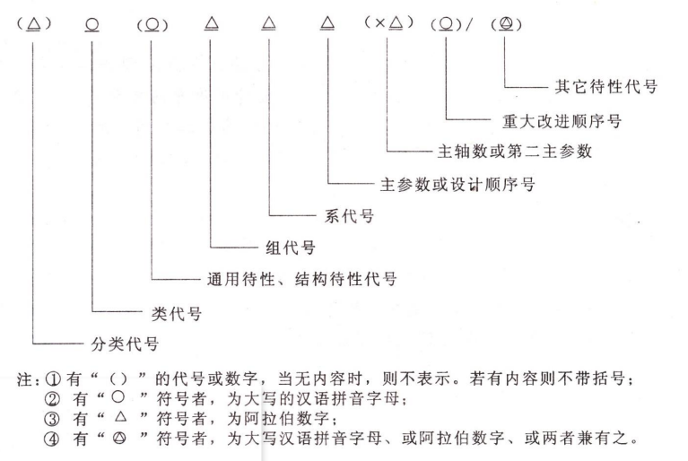

# 回转体零件加工工艺与装备

- 长轴类 : $\frac {L} {D} > 5$
- 短轴类 : $\frac {L} {D} < 5$

## 机床分类概要

### 机床的分类

- 加工方法和刀具

  车床、钻床、镗床、磨床、齿轮加工机床、螺纹加工机床、铣床、刨齿床、拉床、锯床和其他机床

### 机床的型号编制

- 机床的类别代号

  

  > 拼音记忆

- 机床的结构特性代号

  

- 机床主参数、设计顺序号和第二主参数

  主参数和第二主参数用阿拉伯数字给出主参数的折算值

### 机床的主要技术参数

- 主参数

- 基本参数

  - 尺寸参数
  - 运动参数

    - 主运动参数

      - 主轴参数

        $$n = \frac { 1000 v } { \pi d }$$

        运动是直线运动的机床: 主运动参数是机床工作台或滑枕的每分钟往返次数

        

        - 变速范围

          

      - 进给运动参数

      - 空行程功率

  - 动力参数

### 机床运动与零件成形关系

#### 机床的运动

- 简单成形运动

  由单独的旋转运动或直线运动构成

- 复合成形运动

  两个或两个以上旋转运动或（和）直线运动

#### 机床的运动联系

执行件、动力源和传动装置

- 传动链

  由这些构成的传动关系

  - 外联系传动链

    联系动力源和执行件

  - 内联系传动链

    联系复合运动之内的各个分解部分

#### 机床的传动系统

常采用`传动系统图`

## 车削加工方法

### 车削概要

- 工序

  - 车外圆或端面
  - 镗削
  - 钻削
  - 切断
  - 车螺纹
  - 滚花

- 分类

  卧式车床、落地车床(engine lathe,ground lathe);

  立式车床(vertical lathe);

  转塔（六角）车床(turret lathe);

  多刀半自动车床(semi-automatic lathe);

  仿形车床及仿形半自动车床(profiling lathe);

  单轴自动车床(single-axis automatic lathe);

  多轴自动车床及多轴半自动车床(multi-axis automatic lathe);

  专门化车床(special-purpose lathe)

- 结构功能特点

  - 主轴箱

    主轴箱的功用是支承主轴并把动力经变速传动机构传给主轴，使主轴带动工件按规定的转速旋转，以实现主运动。

  - 刀架

    功用是装夹车刀，实现纵向、横向或斜向运动

  - 尾座

    它的功用是用后顶尖支承长工件，也可以安装钻头、铰刀等孔加工刀具进行孔加工。

  - 进给箱（进给的动力源）

    用于改变机动进给量或所加工螺纹的种类及导程。（进给变换机构）

  - 滑板箱（进给的执行机构）

    把进给箱传来的运动传递给刀架，使刀架实现纵、横向进给。滑板箱上装有各种操纵手柄和按钮。

  - 床身

    使各个主要部件在工作时保持准确的相对位置或运动轨迹。

- 主要技术参数

  - 可加工工件的`最大直径`

  - 主轴箱和尾座之间的`最大长度`

  - 最大`功率`以及`转速`

### 常见的几种车床-特点

- 仿形车床

  刀具沿着与模型重叠的轮廓路径运动

- 自动化车床/卡盘式车床

  上下料不需要人工实现

  没有尾座，用于加工单件规则/不规则零件，单轴/多轴

  自动车床适合中、大批量生产

- 螺纹车床或自动棒料机床

  机械装置上所有加工操作均实现自动化，刀具安装在一个特定的六角刀架上。

  在每个螺钉或者零件加工完直径后，棒料自动向前进给后被切断。这些机械能够安装单根或多根轴（效率高）

- 转塔车床(万能型车床)

  在成批生产较复杂的工件时，为了增加安装刀具的数量、减少更换刀具的时间，将`普通车床的尾座去掉`，安装可以纵向移动的多工位转塔式刀架，并在传动和结构上作相应的改变，就成了转塔车床

  加工时刀具轮流切削，不用反复拆卸刀具及测量工件尺寸（尽可能多刀同时加工）

  适合`中小`批量生产、调整好后对工人技术`要求不高`

  转塔车床能够`实现多种切削加工`，例如在同一工件上能车削、扩孔、钻孔、螺纹切削和断面加工

- 数控车床

  调整好后对工人技术要求不高、适合中小批量生产

### 车刀结构与材料

- 结构

  - 整体车刀
  - 焊接车刀

    由一定形状的刀片和刀柄通过焊接连接而成

    刀片: 硬质合金材料（刀柄 45 号钢）

    结构简单、紧凑、刚度好、抗震性好、制造方便、灵活

    切削性能差、刀柄不能重复使用、辅助时间长

  - 机夹车刀

  - 可转位车刀

    使用要求: 定位精度高、刀片夹紧可靠、排屑流畅、使用方便

    刀具使用寿命长、生产效率高、有利于推广新技术、新工艺 有利于降低刀具成本

- 成形车刀(不在分类里面???)

  刀刃根据工件轮廓设计

  分为平体、棱体、圆体

  棱体(重磨次数>平体) => 只能用于外成形面的加工

  平体 => 只能用来加工外成形表面, 重磨次数少

  圆体 => 内、外回转体成形表面, 重磨次数`最多`

## 回转体磨削加工方法

### 外圆磨床

- 应用

  主要用于磨削内、外圆柱和圆锥表面，也能磨削阶梯轴的轴肩和端面

- 效果

  可获得 IT6 ～ IT7 级精度，表面粗糙度 值在 1.25 ～ 0.08 之间

- 主要类型

  普通外圆磨床、万能外圆磨床，无心外圆磨床、宽砂轮外圆磨床和端面外圆磨床等

- 主要参数：最大磨削直径

### 无心外圆磨床

- 简称无心磨床

- 工作特点

  

  磨削式不用顶尖定心和支承（由工件的被磨削外圆面定位）

  为了避免磨削出棱圆形工件，工件的中心应高于磨削砂轮与导轮的中心连线

- 磨削方法

  - 纵磨法

    

    倾斜角度 => 有两个分力 : 推力和磨削力

    工件一个接一个地通过磨削区后，既作旋转运动又作轴向移动，穿过磨削区后从机床后面出去

  - 横磨法

    

    将工件放在托板和导轮上，然后由工件（连同导轮）或砂轮作横向进给

- 优点

  生产率高

  磨削表面的尺寸精度、几何形状精度较高，表面粗糙度值小

  能配自动上料机构，实现自动化生产

### 内圆磨床

- 主要用于磨削圆柱孔和圆锥孔
- 主要类型有普通内圆磨床、无心内圆磨床

### 砂轮结构与材料

- 组成

  由`磨料和结合剂`经压坯、干燥、焙烧及修整而成的

  磨料与结合剂之间有许多`空隙`，起`散热`的作用

#### 磨料

磨料是构成砂轮的主要成分

- 特点: 锋利的尖角, 有高硬度、高耐热性和一定的韧性

- 普通磨料: 刚玉系和碳化物系
- 超硬磨料: 金刚石和立方氮化硼

#### 粒度

- 粒度是指磨料颗粒尺寸的大小
- 分类: 磨粒和微粉

#### 硬度

- 概念

  指砂轮上磨粒受力后自砂轮表层脱落的难易程度

  砂轮硬，即表示磨粒难以脱落；砂轮软，表示磨粒容易脱落

- 选择

  工件硬, 选软砂轮

  遇硬选软, 遇软选硬; 粗软精硬

#### 结合剂

- 作用: 将磨料结合成砂轮

- 砂轮的强度、耐腐蚀性、耐热性、抗冲击性和高速旋转而不破裂的性能，主要取决于结合剂的性能

#### 组织

指砂轮中磨粒、结合剂、气孔三部分体积的比例关系

组织分为紧密、中等和疏松三个类别

#### 形状和尺寸

- 选用原则

  可能的条件下, 砂轮外径宜选大一些 => 提高生产率和降低工件表面粗糙度值

  纵磨时，应选用较宽的砂轮

  磨削内圆时，砂轮外径一般取工件孔径的三分之二左右

  

## 孔加工机床与刀具

- 分类

  - 从实体材料中加工出孔的刀具

    如麻花钻、扁钻、中心钻和深孔钻

  - 对工件上的已有的孔进行再加工

    扩孔钻、锪钻、铰刀及镗刀

### 钻床

用钻头在工件上加工孔的机床

- 用途: 通常用于加工尺寸较小, 精度要求不太高的孔

- 主参数: 最大钻孔直径

- 加工种类

  钻孔、扩孔、铰孔、锪孔以及攻螺纹

  

- 分类

  - 立式钻床

    适合中小批量生产、要移动工件加工不同位置的孔

  - 摇臂钻床

    大而重的工件，一般希望工件固定不动，而移动主轴

### 镗床

- 用途: 通常用于加工尺寸较大、精度要求较高的孔

  如各种箱体、汽车发动机缸体等零件上的孔

- 运动方式/特点:镗刀的旋转为主运动，镗刀或工件的移动为进给运动

- 镗床上可以实现的工作类型：铣削、钻孔、扩孔、铰孔、锪平面

- 卧式镗床

  完成粗加工和精加工

  - 主要参数：镗轴直径

- 坐标镗床

  具有坐标位置的精密测量装置（准确的进行定位）、刚性和抗震性好

  - 主要参数：工作台宽度

  - 立式镗床——加工与轴线垂直的孔系
  - 卧式镗床——加工与轴线平行的孔系

- 金刚镗床

  高精度、高速（切削速度）、背吃刀量小、进给量小

  - 主运动: 主轴高速旋转

  主轴短粗、刚度高

### 孔加工刀具

- 用途

  - 从实体材料中加工出孔的刀具

    麻花钻、扁钻、中心钻和深孔钻

  - 对工件上的已有的孔进行再加工

    扩孔钻、锪钻、铰刀及镗刀

- 麻花钻

  最常用、粗加工

  - 改进方式——群钻：标准麻花钻存在切削刃长、前角变化大、螺旋槽排屑不畅、横刃部分切削条件很差等结构问题

- 中心钻

  加工各种轴的中心孔

- 深孔钻

  加工 $\frac {L} {D} >20 \sim 100$ 的特殊深孔（在加工中必须解决断屑、排屑、冷却、润滑和导向等问题）

- 扩孔钻

  铰孔、磨孔前的预加工扩孔（毛胚孔的扩大）——用于成批大量生产

- 锪钻

  在已加工孔上锪各种沉头孔、孔端面

- 铰刀

  对孔进行精加工、半精加工

- 镗刀

  用于箱体上孔的粗、精加工，其种类很多

  一般可分为单刃镗刀和多刃镗刀两大类

- 拉刀

  加工精度/效率较高的多齿刀具（大批量生产、加工内外表面）

## 回转表面加工中工件的装夹

### 加工回转表面时工件的安装

- 思考

  定位 => 工件与刀具之间有相对正确的位置

  夹紧 => 怎样使工件在加工中保持位置不变

- 工件的定位

  - 内孔定位

    当加工外圆或内孔表面，且待加工表面与`内孔`之间有位置或尺寸精度要求

    长心轴或短心轴

  - 外圆表面定位

    当加工外圆或内孔表面，且待加工表面与`外圆面`之间有位置或尺寸精度要求

    三爪卡盘, V 形块, 轴套

  - 圆孔或中心孔定位

    当回转体工件有内圆表面时，可用圆柱形或圆锥形心轴与内圆表面配合实现圆孔定位

    圆柱形或圆锥形

    常在轴的两端钻中心孔, 然后采用中心孔定位(基准统一)

  - 组合定位

    端面与内孔或外圆的组合

- 工件的夹紧

  工件定位的同时或定位后需要用力夹紧才能保证在正确的位置经受加工载荷而不移动和破坏

### 车床和圆磨床夹具特点及设计要点

#### 车床用夹具与附件

车床上常用的夹具有卡盘，夹头，法兰盘，心轴等

- 夹头

  适用于夹持节面较小的工件

#### 圆磨床夹具

- 特点

  与车床夹具在结构上相似

  但圆磨床夹具的精度要求比车床夹具高

  须经过很好的平衡

- 磨外圆及台肩夹具

  使用锥套定位 => 可以消除间隙，以保证工件外圆对锥孔的径向跳动

  快卸螺母夹紧工件 => 减少装卸工件的辅助时间

- 电磁无心夹具

  用工件的外圆表面定位（不是定心）磨内孔，或是以外圆表面本身定位磨外圆

  无心磨床的工作原理相仿

### 钻床和镗床夹具特点和设计要点

#### 钻床夹具

也称钻模，用于钻床上孔加工的定位与夹紧

- 分类

  固定式钻模 => 加工精度高

  翻转式钻模 => 翻转过来, 钻箱体底部的孔

  盖板式钻模 => 大中型件, 由于重力, 无需过于夹紧

  钻模板 => 主要定位元件, 定位钻模与钻刀,工件之间的相对位置

#### 镗床夹具

主要用于加工精密孔或孔系

- 分类:双支承镗模、单支承镗模和无支承镗模

- 组件

  镗杆, 镗套, 镗模支架, 镗模底座以及必要的定位, 夹紧装置

- 镗杆

  直径由工件孔径和镗刀截面尺寸确定

  d > 50mm : 镶条式

  d < 50mm : 整体式

  - 支撑方式

    - 单支承引导

      用于小孔和短孔加工

      

    - 双支承引导

      主轴精度不影响工件孔的位置精度

      

- 镗套

  直接影响工件孔的尺寸精度, 位置精度和表面粗糙度

  - 固定式

    镗套不随镗杆移动

    

    外形尺寸小, 结构简单, 精度高

    易磨损 => 低速镗孔

  - 回转式镗套

    镗杆和镗套之间只有相对移动而无相对转动

    

    适合高速镗孔

## 回转体的加工工艺案例分析

### 数控车床加工的典型零件

- 轴承座
- 轴承内环
- 套管缩头

### 复杂形状的零件加工

- 泵轴
- 曲轴
- 带圆螺纹的管状零件

### CA6140 车床主轴加工工艺分析

#### 零件加工工艺制订的基本原则

- 粗精加工分开的原则

  粗加工阶段： 车端面钻中心孔、粗车外圆等

  半精加工阶段：半精车外圆，各辅助表面(键槽、花键、螺纹等)的加工与表面淬火

  精加工阶段：主要表面(外圆表面与锥孔)的精加工

- 基准使用原则

  - [ ] 累, 孩子, 看书吧

  - 基准统一原则

    两中心孔 => 基准重合原则和基准统一原则

  - 基准重合原则
  - 互为基准原则

#### 加工顺序安排原则

- 先基准的原则
- 深孔加工的安排
- 先外后内、先大后小原则
- 先主后次的原则

#### 加工方法与设备选择原则

- 生产批量与加工设备相适应原则
