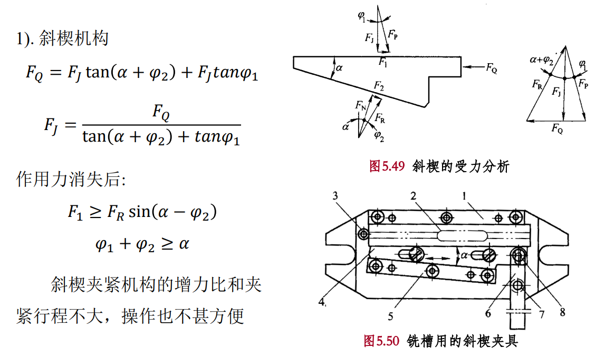
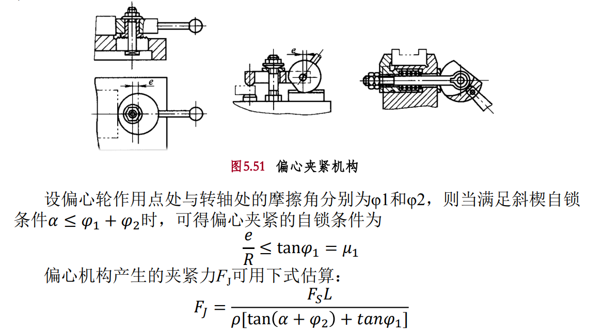
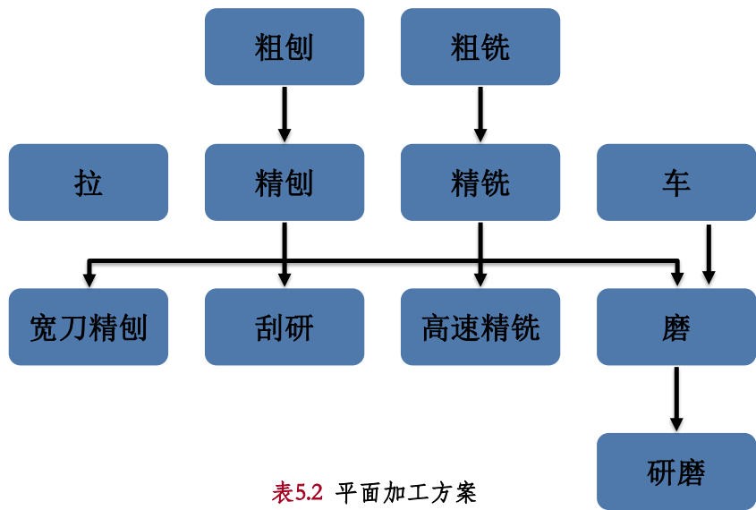
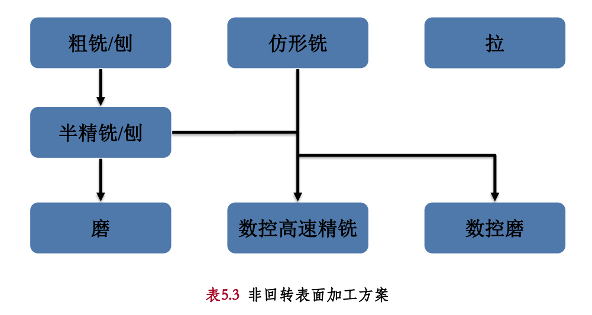

# 非回转体零件加工工艺与装备

- 主要加工方法

  铣削、刨削及插削、拉削、磨削等

## 铣削加工

### 铣削加工方法概述

铣刀旋转作主运动，工件或铣刀作进给运动的切削加工方法

特别:非通透的内型腔表面, 精度为 IT7-IT10

- 工艺特点：效率高、散热好（多齿、切出时散热），但不平稳（多齿切入切出引起切削力变化引发振动）

  高速铣削能提高生产效率以及表面质量

### 铣削参数和铣削方式

- 铣削用量

  - 铣削速度
  - 铣削深度$a_p$(被吃刀量)

    平行于轴线方向进行测量

  - 铣削宽度$a_e$（侧吃刀量）

    垂直于轴线方向进行测量

  - 进给量(进给量、每齿进给量和进给速度)

  

  

- 铣削切削层参数

  铣削切削层：铣削中铣刀相邻两个刀齿在工件上所形成加工表面之间的切去材料层

  - 切削层公称厚度$h_D$

    铣刀相邻两个刀齿在工件所形成加工表面之间的垂直距离

    与$f$有关

  - 切削层公称宽度$b_D$

    铣刀相邻两个刀齿在工件所形成加工表面之间的垂直距离

    与$a_p$相关

  - 切削层总面积

- 铣削方式

  - 周铣:用`圆周上`的刀刃切削，刀具`轴线平行`于被加工表面
  - 端铣:用`端面上`的刀刃切削，刀具`轴线垂直`于被加工表面

  

  - 对比

    端铣的加工质量比周铣高, 刀齿数多，铣削过程较平稳, 最小切削厚度不为零，后刀面与工件的摩擦比周铣小，有利于提高刀具寿命和减小表面粗糙度

    生产率比周铣高

    端铣的适应性比周铣差, 端铣一般只用于铣平面

    周铣可采用多种形式的铣刀加工平面、沟槽和成形面等, 适应性强，应用广泛

  - 顺铣: 工件的`进给`方向与铣刀`旋转`方向`相同`

    顺铣时, 铣削力的垂直分力向下 => 将工件压向工作台，增大夹紧力，减少工件振动可能性，`使铣削较平稳`

    刀齿`以最大铣削厚度切入工件然`后逐渐减小至零，避免了挤压、滑行现象，后刀面与工件无摩擦因而不容易磨损，`加工表面质量较好`

    这样的切入会使刀齿受冲击力而增加磨损可能性，`降低铣刀寿命`

    机床没有消除丝杠间隙机构时`一般不采用顺铣`

  - 逆铣: 工件的`进给`方向与铣刀`旋转`方向`相反`

    铣削力的垂直分力向上, 使工件需要较大的夹紧力

    铣削厚度从零逐渐增至最大，切削力也由零逐渐增加到最大值，`避免了刀齿因冲击而破损`

    由于铣刀刀刃口处总有圆弧存在, 刀齿每当切入工件的初期，都要先在工件已加工平面上挤压、滑行，使后刀面与工件产生摩擦，会加速刀齿磨损，同时也使工件已加工表面质量下降，`造成工件表层加工硬化`

  

  - 对称铣削: 切入、切出时的切削层公称厚度相等

    为使捯饬超过冷硬层切入工件, 可用

  - 不对称铣削: 切出时的切削层公称厚度最小

    加工不锈钢和耐热合金等难切削材料 => 可提高硬质合金钢铣刀的切削速度和减小剥落破损

    减小冲击 => 延长刀具寿命

  

### 铣刀的类型及用途

- 端面铣刀

  `立式或卧式`上加工平面

  铣刀轴线垂直于被加工平面

  大多数端铣刀刀盘直径比较大

  刀杆伸出较短，刚性好，参与切削的刀齿较多

- 圆柱铣刀

  用于在`卧式铣床`上加工平面

  仅在圆柱表面上有切削刃

  承受切削载荷的能力通常`低于端铣刀`

  大部分`高速钢`制造

- 立铣刀

  加工平面、沟槽、台阶面和内外成形曲面

  圆柱面上的刀刃是主切削刃，端面上的刀刃是副切削刃

  `一般不能沿轴向进给`

  大部分`高速钢`制造

- 槽铣刀

  加工机械零件上的各种形状的沟槽

- 成形铣刀

  成形铣刀用于在普通铣床上加工成形表面

  刀齿廓形与工件加工表面吻合（专门设计制造）

  - 加工齿轮:

    - 盘形

      模数小的齿轮(齿条, 齿轮和人字齿轮)

      结构简单, 加工效率和生产率低

    - 指形

      模数大的齿轮(无空刀槽的人字齿轮)

### 铣刀角度

- [ ] 建议白给

### 铣床的类型及用途

- 卧式升降台铣床和万能卧式升降台铣床

  适应加工各种中、小型零件

- 立式升降台铣床（立铣）

  刚度较大，抗振性较好，可用较大铣削用量

  应用广泛，可加工多种复杂面

- 龙门铣床

  适用于加工大型工件上的平面和沟槽

  生产率高，很高的刚性和抗振性

## 刨削和插削加工

### 刨削加工方法概述

用刨刀对工件作水平相对直线往复运动的切削方法

- 特征

  主运动是直线往复运动，进给运动是直线间歇运动；只在进程中进行切削，`回程为空程`

  切削速度受限，加工效率低，切削时有冲击和振动现象

- 主要用途

  

### 插削加工方法概述

- 插削（立式刨削）

  用插刀相对工件作`垂直直线往复运动`的切削加工方法称为插削加工

  用于单件, 小批生产

  加工内孔中的键槽等内表面, 也可加工魔秀外表面

  

### 刨刀与插刀

都只作间歇直线运动

与外圆车刀类似，但刀体横截面一般比车刀大 1.2### 倍,两者的安装结构有所不同

### 刨床与插床

- 刨床的结构分类: 牛头刨床、龙门刨床，插床也属于刨床类

- 牛头刨床

  多加工与安装基面平行的表面, 故卧式

  适用于中小型零件的单件, 小批加工

- 龙门刨床

  刨削较长的零件, 不宜使用牛头刨床, 采用龙门刨床

  大型, 重型的中小批生产, 多件同时加工

  加工长而窄的平面

  大批量生产 => 龙门铣床

- 插床

  用于单件, 小批生产, 中小型零件

## 拉削加工

### 拉削加工方法概述

- 概念: 在拉床上用拉刀加工工件的方法称为拉削加工（刨削的发展）

- 特征

  主运动为刀具的低速无反复直线运动

  一个拉削行程中就完成了粗加工、半精加工和精加工

  

  高效率, 高精度加工方式

  效率 : 铣削的 3-8 倍

  IT7-IT8

  Ra:### $\mu m$

  常用于加工圆孔和各种异形孔, 也可加工平面和成形表面

  刀具磨损慢, 寿命长

  结构复杂成本高 => 成批, 大量或精度高, 形状特殊, 无法使用其他加工的单件, 小批

### 拉刀

- 结构分类

  - 整体式: 高速钢
  - 组合式: 硬质合金钢

工件表面被拉削成形的过程中可能应用分层式或分块式、综合式成形的工艺原理

### 拉床

活塞每往复运动一次，加工完一个工件

- 加工表面种类分类: 内拉床和外拉床

- 卧式拉床

  最常用, 多用于花键孔, 键槽和精孔

- 立式拉床

  行程短, 多用于车辆气缸等零件的平面

## 磨削加工

砂轮是通用的, 但是磨床不同

### 平面磨削

- 平面磨削（精加工）：用砂轮磨削工件的平面

  IT5-IT6

- 平面磨削的方法

  - 圆周磨削

    接触面积小, 摩擦发热少, 排屑和冷却好, 工件变形小

    高精度, 但效率不高

  - 端面磨削:没有横向进给运动

    接触面接大, 表面容易烧伤, 排屑和冷却不好, 工件变形大

- 平面磨削的工艺方法

  - 横向磨削法

    应用最广

  - 深磨法

    横向磨削法的发展

    纵向进给量小, 只作两次垂直进给

  - 阶梯磨削法

    生产效率高

- 砂轮选择

  周边磨削一般用平直形砂轮

  端面磨削一般用筒形砂轮

- 磨削用量

  通常先确定砂轮、磨削速度和修整条件，再选择相应的工件速度、砂轮切削深度、磨削宽度

- 平面磨削质量分析

  - 几何形状误差: 主要是加工表面间的相互位置误差
  - 常见的加工缺陷: 表面磨痕、表面波纹、表面烧伤、几何形状误差

    表面磨痕:砂轮与工件的接触面积大, 排屑和散热不好

    表面波纹:砂轮轴承间隙大, 不平衡

    表面烧伤: 磨削用量大, 砂轮硬度高, 粒度细

### 成形磨削

一种成形表面的加工方法，具有高精度、高效率的优点

- 分类

  成形砂轮磨削法

  夹具磨削法

- 成形砂轮磨削法

  采用成形砂轮磨削需要将砂轮修整成工件型面的`反型`

  直接由具有这样的砂轮磨削出工件的对应型面

  - 砂轮修形方法

    修整砂轮角度

    修整砂轮圆弧

    修整砂轮非圆弧曲面

- 夹具磨削法

  通过调整夹具位置而改变工件的加工位置, 从而加工出所需的表面形状

  - 用正弦精密平口钳/正弦磁力台
  - 用正弦分中夹具
  - 用万能夹具
  - 光学投影

### 非回转表面加工用磨床

- 平面磨床

  用于磨削各种零件的平面

  砂轮的旋转是主运动，其余的都是进给运动

- 光学曲线磨床

  用于磨削平面、圆弧面和非圆弧形的复杂曲面

  适合于单件或小批生产中各种复杂曲面的磨削

- 磨削加工中心

  具备磨削工具自动交换或自动选择的功能

- 特点

  磨削加工的复合化与集约化

## 非回转表面加工中工件的装夹

### 非回转表面加工用夹具的结构

- 夹具

  附加装置结构

  保证各工序质量、提高生产率、保障工人安全和减轻劳动强度

### 加工非回转表面时工件的安装

#### 工件的定位

需要用定位元件限制多少个自由度

#### 工件的夹紧

工件定位的同时或定位后需要用力夹紧才能保证在正确的位置经受加工载荷而不移动和破坏

- 斜楔机构

  

  增力比和夹紧行程不大, 操作不方便, 很少做夹紧装置

- 偏心机构

  

  自锁性能差, 增力比小, 常用于切削比较平稳且切削力不大的场合

- 螺旋机构

  通过螺钉, 螺母夹紧

  小楔角斜楔机构，夹紧原理与斜楔相同，但其增力系数大，容易满足自锁条件

- 工件安装示例

### 铣/刨床夹具特点及设计要点

- 铣床夹具的特点、类型及对刀调整

  - 特点: 足够的强度和刚度；良好的自锁性和抗振性；通常设有专门的快速对刀装置
  - 类型（进给方式）:直线进给式、圆周进给式、曲线靠模仿形进给式
  - 对刀调整: 试削调整、标准件调整、对刀装置调整

### 非回转体在磨床上的装夹

- 磨床夹具的作用

  - 保证零件的加工精度
  - 扩大磨床的工艺范围
  - 缩短辅助时间提高劳动生产率
  - 降低对工人的技术要求和减轻工人劳动强度

- 磨床上工件的装夹

  - 用电磁吸盘装夹
  - 用其他吸盘装夹

    永磁吸盘：静电吸盘；真空吸盘

  - 用精密虎钳或简易具装夹
  - 薄片工件磨削时的装夹

## 非回转表面加工分析与工艺应用

### 非回转表面加工分析

- 平面加工

  

- 非回转曲面加工

  

### 非回转零件的加工工艺案例分析

- 箱体零件的结构特点和技术要求
- 箱体零件的定位基准和加工顺序

  - 定位基准
  - 加工顺序

    - 先面后孔
    - 分开粗精加工
    - 工序集中

      大批量生产中广泛采用组合机床、专用机床等工序集中的高生产率设备加工箱体零件，这也利于保证零件各表面之间的位置精度
