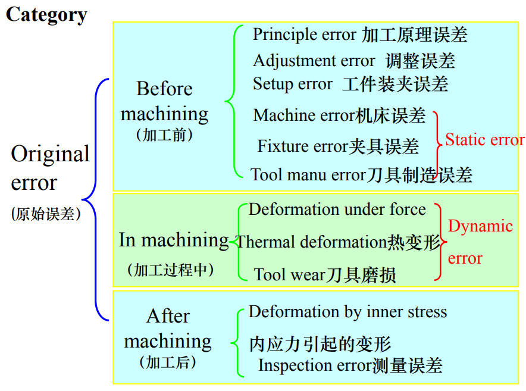
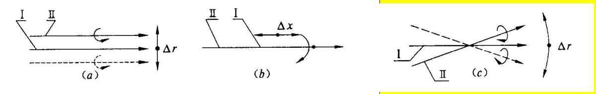
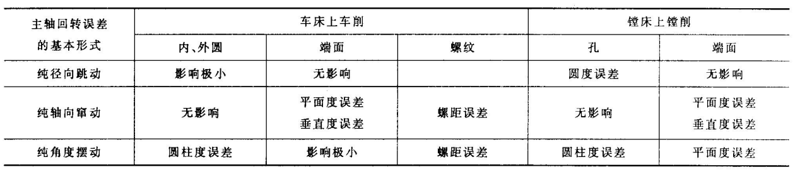
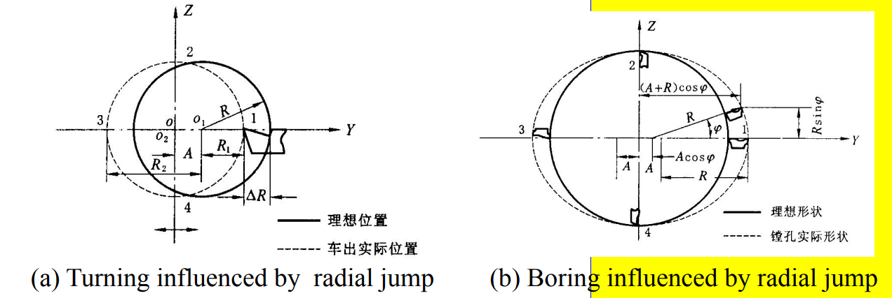
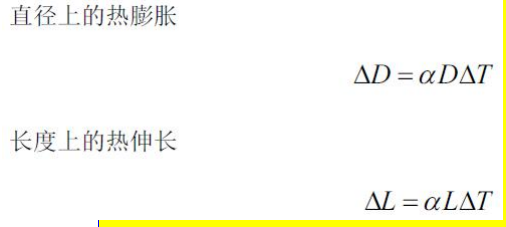

# 机械加工精度

- 机器零件的加工质量

  一般用`机械加工精度`和`加工表面质量`两个重要指标表示

## 机械加工精度的基本概念

### 加工精度与加工误差

- 加工精度：零件加工后的实际几何参数与理想几何参数`相符合的程度`。符合程度越高则加工精度就越高。

- 加工误差：零件加工后的实际几何参数对理想几何参数的`偏离程度`称为加工误差。

“加工精度”和“加工误差”是评定零件几何参数准确程度的`两种不同概念`

生产实际中用`控制加工误差`的方法或`主动适应加工方法`来保证加工精度

### 研究加工精度的方法

- 因素分析法
- 统计分析法

## 影响加工精度的因素

- 工艺系统

  - 机床
  - 夹具
  - 刀具
  - 工件

- 原始误差

  `工艺系统`中凡是能直接引起加工误差的因素都称为原始误差。

- 误差种类

  - 工艺系统静误差：无切削负荷下检验
  - 工艺系统动误差：有切削负荷

  

- 误差敏感方向

  把对`加工误差影响最大`的那个方向（即通过刀刃的加工表面的法线方向）称为**误差敏感方向**。

### 加工原理误差

- 加工原理: 加工表面的形成原理

- 加工原理误差

  由于采用了近似的切削运动或近似的切削刃形状所产生的加工误差

### 机床误差

指来自机床本身的`制造误差`、`安装误差`和`磨损`

##### 主轴回转误差

- 概念

  存在着各种影响因素，使主轴回转轴线的位置发生变化

  将主轴实际回转轴线对理想回转轴线漂移在误差敏感方向上的最大变动量称为主轴回转误差

- 径向跳动

  实际回转轴线始终平行于理想回转轴线，在一个平面内作等幅的跳动

- 轴向窜动

  实际回转轴线始终沿理想回转轴线作等幅的窜动

- 角度摆动

  实际回转轴线与理想回转轴线始终成一倾角，在一个平面上作等幅摆动，且交点位置不变

- 主轴回转误差对加工精度的影响

  

  - 径向跳动

    

- 提高主轴误差精度的方法

  提高主轴零件的制造精度

  对轴承进行预紧

  消除主轴回转误差对工件的影响

##### 导轨误差

- 导轨在垂直面内的直线度误差

  - 卧式车床或外圆磨床

    误差非敏感方向, 忽略不计

  - 平面磨床、龙门刨床

    误差敏感方向, 导轨误差将直接反映到被加工的零件上

- 导轨在水平面内的直线度误差

  - 卧式车床或外圆磨床

    误差敏感方向

  - 平面磨床、龙门刨床

    误差非敏感方向, 忽略不计

- 前后导轨的平行度误差
  - 卧式车床
    前后导轨存在平行度误差（扭曲）时, 会引起工件的形状误差
- 导轨与主轴回转轴线的平行度误差

  若车床导轨与主轴回转轴线在`水平面内有平行度误差` => 车出的内外圆柱面就产生`锥度`

  垂直面内有平行度误差 => 圆柱面成`双曲线回转体`

- 提高导轨误差精度的方法

  选择合适的导轨形状及装配形式

  提高导轨的制造精度

  选择合适的导轨类型

### 传动链误差

传动链误差是指机床内联系`传动链始末两端`传动元件之间相对运动的误差

- 改善机床传动链误差的方法

  缩短传动链，即减少传动单元

  降低传动比

  减少驱动件加工和装配带来的误差

  及时调整校正设备

### 工艺系统受力变形

#### 工艺系统刚度

工艺系统刚度是指切削力在加工表面法向的分力 $F_y$ 与 $F_x, F_y, F_z$ 同时作用下产生的沿法向的变形 y系统 之间的比值。

$$K_\mathrm{系统} = \frac{F_y}{y_\mathrm{系统}}$$

刚度的倒数称为柔度 C

由变形量的叠加得出:

$$\frac{1}{K_\mathrm{系统}} = \frac{1}{K_{\mathrm{机床}}} + \frac{1}{K_{\mathrm{夹具}}} + \frac{1}{K_{\mathrm{刀具}}} + \frac{1}{K_{\mathrm{工件}}}$$

#### 误差复映

$$\Delta_\mathrm{工件} = \frac{C}{K_\mathrm{系统} + C} \Delta_\mathrm{毛坯} = \varepsilon \Delta_\mathrm{毛坯}$$

当毛坯有形状误差或位置误差时，加工后工件仍会有同类的加工误差，但每次走刀后工件的误差将逐步减小。

- 提高受力影响加工精度的方法

  - 提高加工系统的刚度
  - 减少切削力

### 工艺系统的热变形

- 通过控制热变形提高加工精度的方法

  减少热量和对热源的隔离

  采用热补偿方法

  以适应机器零件的适当结构

  加快热平衡过程

  控制环境温度

### 工件残余应力引起的变形

- 降低或消除残余应力的方法

  采用热处理工艺消除残余应力，如消除退火

  合理安排生产工艺

  其它方法，如增加零件刚度、优化零件结构等

## 加工误差的统计分析

### 加工误差的分类

- 系统误差
  - 常值系统误差：在连续加工一批零件时，加工误差的大小和方向基本保持不变。
  - 变值系统误差：加工误差是按零件的加工次序作有规律的变化。
- 随机误差：连续加工一批零件，加工误差的大小和方向无规律地变化。

##### 随机误差的特点

1. 在一定加工条件下，随机误差的数值在一定范围内波动。
2. 绝对值相等的正误差与负误差出现概率相等。
3. 误差的绝对值越小，出现概率越大；误差的绝对值越大，出现概率越小。

#### 统计的一些概念

尺寸间隔：$\Delta X = (X_{max} - X_{min}) / (k - 1)$

频数 m：同一尺寸间隔内的零件数量。

频率：频数与样本总数 n 之比

频率密度：频率除以尺寸间隔

#### 废品率

当分布中心与公差中心重合时，不产生废品的条件是：

$$\delta \ge 6 \sigma$$

尺寸过大或过小的废品率为：

$$Q_\mathrm{废品} = 0.5 - A$$

当分布中心与公差中心不重合时，不产生废品的条件是：

$$\delta \ge 6 \sigma + 2 \Delta_\mathrm{系统}$$

#### 工艺能力系数

$$C_p = \frac{\delta}{6 \sigma}$$

分五级：

- 特级：Cp > 1.67
- 一级：1.33 ~ 1.67
- 二级：1.00 ~ 1.33
- 三级：0.67 ~ 1.00
- 四级：Cp < 0.67

### 提高加工误差的途径

1. 减少误差法
2. 误差补偿法
3. 误差分组法
4. 误差转移法
5. “就地加工”法
6. 误差平均法
7. 控制误差法

> 详见课本[1] P277

> 有效提高机械加工精度途径的探索是机械制造工程技术人员的**终生追求**。

[1]: 刘旺玉, 曾志新, 张赛军, 等. 机械制造技术基础[M]. 第二版. 北京: 高等教育出版社, 2021.
