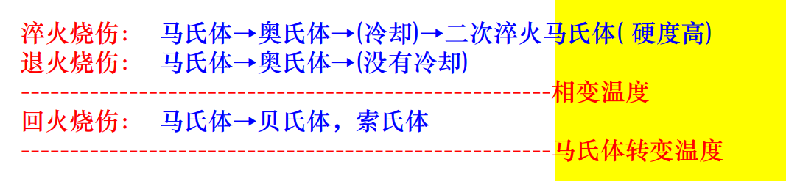

# 加工表面质量

许多性能取决于其组件的表面质量

机械加工表面在一定程度上存在微观形貌、加工硬化、残余应力和金相组织的变化

## 机械加工后的表面质量

- 表面层的几何形状

  表面粗糙度: 其波长与波高的比值 $\frac {L_1} {H_1} < 40$

  加工精度: $\frac {L_3} {H_3} > 1000$

  表面波纹度: $40 \leq \frac {L_2} {H_2} \leq 1000$

- 表层物理力学性能

  - 加工硬化

    工件表面金属层会发生强烈的冷塑性变形，从而提高其强度和硬度

  - 金相组织变化

    切削热会使工件表面温度升高，使表层金相组织发生变化

  - 残余应力

    由于切削变形和切削热的影响，工件表层会产生残余应力

  - 微裂纹

- 表面质量对零件使用性能的影响

  - 对零件耐磨性的影响

    热处理状态和润滑状态都确定后, 零件的表面质量(表面粗糙度与粗糙度的轮廓形状及纹路方向)对零件的磨损特性起着决定性的作用

    表面层的`冷作硬化`可以显著`降低`零件的`磨损`

    如果表面硬化过多, 加剧磨损

  - 对疲劳强度的影响

    构件表面层的冷硬化会阻碍裂纹的形成和扩展，提高零件的疲劳强度(要适当)

    表层残余压应力可以部分抵消工作载荷产生的拉应力，从而抑制疲劳裂纹的扩展

  - 对零件抗腐蚀性能的影响

    表面粗糙度较大, 产生化学腐蚀, 电化学腐蚀

    表面内应力会降低构件的抗冲蚀性能

  - 对配合质量的影响

    越大越差

  - 对配合质量的影响

    密封性、性能和摩擦系数

## 机械加工后的表面粗糙度

### 切削加工后的表面粗糙度

- 切削加工时导致的原因

  - 几何因素

    进给量是影响最大表面粗糙度的最主要因素

  - 物理因素
  - 工艺系统的振动

- 要考虑的主要因素

  磨料粒度

  磨料粒度

  砂轮转速

  工件的速度

  径向进给量

  轴向进给量

- 冷作硬化产生的原因

  金属切削或磨削加工层塑性变形时，表面层的晶粒得到强化

## 机械加工后的表面层物理机械性能

- 冷作硬化的指标

  - 冷硬层的深度$h$
  - 表面层的显微硬度$H$
  - 硬化程度$N = \frac {H} {H_0}$

- 加工硬化

  加工硬化的程度取决于`塑性变形`和`变形温度`

  - 完成强化
  - 不完全强化: 取决于变形温度

- 影响冷作硬化的主要因素

  - 刀具

    - 刀具的`切削刃口圆角`和`后刀面`的`磨损量`:越大, 冷作硬化层越大
    - 前角减少时，冷硬也增大

  - 被加工材料

    硬度愈低、塑性愈大，切削后的冷硬现象愈严重

  - 切削参数

    当切削速度增加时(切削力减小)，塑性变形程度减小，同时温度升高，有利于加工硬化层的`恢复`。当`进料增加`(进给)时，切削力和塑性变形也会增加，因此加工硬化也会增加

- 金相组织变化的原因

  有很高温升和很大的温度梯度，出现金相组织的变化

- 磨削烧伤

  磨削时的加热速度促使加工表面`局部形成瞬时热集聚`现象，有很高温升和很大的`温度梯度`，出现`金相组织`的变化

  - 结果

    强度和硬度下降

    产生残余应力

    甚至引起裂纹

  - 类型

    - 回火烧伤

      超过马氏体转变温度而未超过相变温度

      转化成硬度降低的回火组织:索氏体或屈氏体

    - 淬火烧伤

      磨削区温度超过相变温度，马氏体转变为奥氏体

      冷却急剧

      二次淬火马氏体(硬度更高)

    - 退火烧伤

      磨削区温度超过相变温度，马氏体转变为奥氏体

      冷却缓慢

    

- 影响磨削加工时金相组织变化的因素

  - 工件材料
  - 磨削温度、温度梯度及冷却速度

- 残余应力产生的原因

  - 冷态塑性变形

    表层残余压应力，里层残余拉应力

  - 热态塑性变形

    表层残余拉应力，里层残余压应力

  - 金相组织变化

    表面层体积膨胀，产生压应力；表面层体积缩小，产生拉应力

  主要因素:刀具的前角、切削速度、加工材料和切削液

- 磨削裂纹

  由拉应力引起的

  通常与磨削烧伤一起出现

## 控制加工表面质量的工艺途径

- 减小残余拉应力、防止磨削烧伤和磨削裂纹的工艺途径

  - 原则

    - 减少磨削热的发生
    - 加速磨削热的传出

  - 选择合理的磨削参数
  - 选择有效的冷却方法
