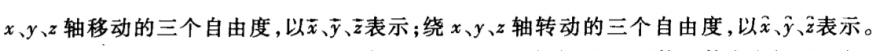
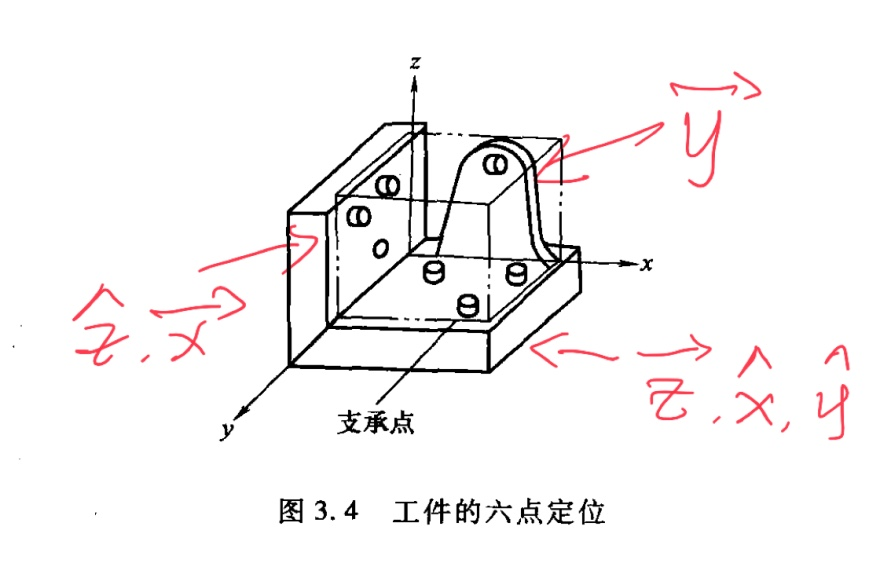
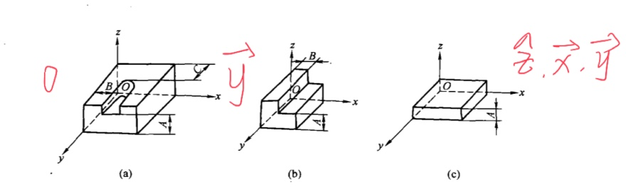

# 零件加工工艺的基本概念与知识

基准先行

粗精加工分开

阶段化

## 零件机械加工的目标与内容

## 机械加工工艺基本概念

### 生产过程

### 工艺过程

### 生产纲领与生产类型

- 生产纲领

生产纲领是指企业在计划期内应当生产的产量和进度计划

- 生产类型

生产类型是指企业生产专业化程度的分类。

生产类型分为单件生产、成批生产和大量生产三种

## 工件定位原理

- 一批工件在夹具中占有正确的加工位置
- 夹具装夹在机床上的准确位置
- 刀具相对夹具的准确位置

> 涉及三层关系,即零件相对于夹具、夹具相对于机床、零件相对于机床。工件的最终精度是由零件相对于机床获得的。

### 六点定位原理

若使物体在某方向有确定的位置，就必须限制在该方向的自由度，所以要使工件在空间处于相对固定不变的位置，就必须对六个自由度加以限制。

- 限制的方法

> 用相当于六个支承点的定位元件与工件的定位基准面接触

> 不一定要限定六个自由度

> 注意地面也是一个定位元件

- 长 V - 4
- 短 V - 2
- 长心轴 - 4
- 短心轴 - 2

