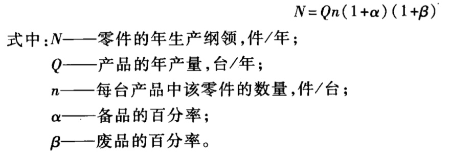

# 零件加工工艺的基本概念与知识

基准先行

粗精加工分开

阶段化

## 零件机械加工的目标与内容

## 机械加工工艺基本概念

### 生产过程

### 工艺过程

### 生产纲领与生产类型

- 生产纲领

生产纲领是指企业在计划期内应当生产的产量和进度计划

- 生产类型

生产类型是指企业生产专业化程度的分类。

生产类型分为单件生产、成批生产和大量生产三种

## 工件定位原理

- 一批工件在夹具中占有正确的加工位置
- 夹具装夹在机床上的准确位置
- 刀具相对夹具的准确位置

> 涉及三层关系,即零件相对于夹具、夹具相对于机床、零件相对于机床。工件的最终精度是由零件相对于机床获得的。

### 六点定位原理

若使物体在某方向有确定的位置，就必须限制在该方向的自由度，所以要使工件在空间处于相对固定不变的位置，就必须对六个自由度加以限制。

- 限制的方法

> 用相当于六个支承点的定位元件与工件的定位基准面接触

> 不一定要限定六个自由度

> 注意地面也是一个定位元件

- 长 V - 4
- 短 V - 2
- 长心轴 - 4
- 短心轴 - 2

基准

误差:两类 △
△ 不

## 加工余量、工艺尺寸链、经济加工精度

### 加工余量的概念

- ![][3]

### 影响加工余量的因素

- 上工序表面质量 Ra、T.的影响
- 上工序尺寸公差(s.)的影响
- 上工序各表面相互位置空间偏差(p.)的影响
- 本工序加工时装夹误差(▲eh)的影响

### 确定加工余量的方法

- 计算法
- 查表法
- 经验法

### 工艺尺寸链

- 尺寸链概念
- 尺寸链的分类
  - 按尺寸链的应用范围分
  - 按尺寸链中各组成环所在的空间位置分
  - 按尺寸链各环的几何特征分
  - 按尺寸链之间相互联系的形态分
- 尺寸链计算的基本公式
